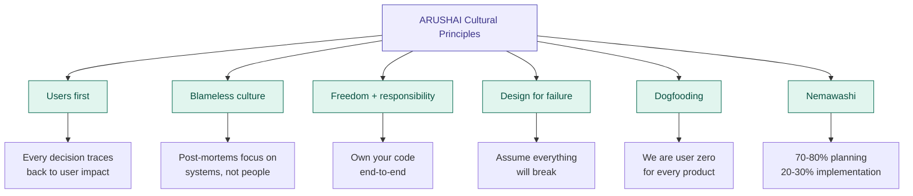
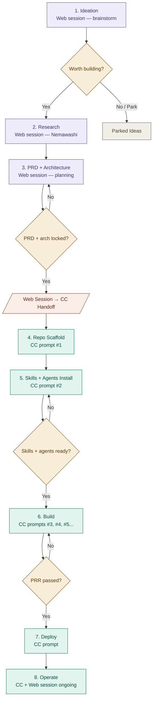
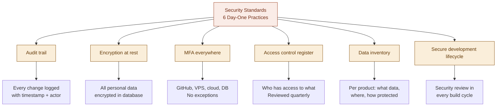

# ARUSHAI Operating System Document

| Field | Value |
|-------|-------|
| Version | 1.10.1 |
| Last Updated | 2026-03-17 |
| Author | Irfan |
| Status | v1.10.1 — AI Session Protocol expanded to 15 rules. 6 cultural principles + 44 engineering/operational/security/session standards. Living document — will be updated as the company evolves. |

---

## Table of Contents

1. [Company Identity and Mission](#section-1--company-identity-and-mission)
2. [The Decision-Making Framework](#section-2--the-decision-making-framework)
3. [The Product Development Lifecycle](#section-3--the-product-development-lifecycle)
4. [The CC Interaction Protocol](#section-4--the-cc-interaction-protocol)
5. [The Context Management System](#section-5--the-context-management-system)
6. [The Financial Framework](#section-6--the-financial-framework)
7. [The Security and Governance Framework](#section-7--the-security-and-governance-framework)
8. [The Evolution Roadmap](#section-8--the-evolution-roadmap)

---

## Section 1 — Company Identity and Mission

### Company Name

ARUSHAI Systems Private Limited

### Registration

India (Private Limited Company). The company targets the Indian market as its primary customer base. Operations are managed remotely from Qatar by the founder.

### Founded By

Irfan — 15-16 years of hands-on technology experience spanning full-stack development, AI/ML, and systems architecture.

### Company Vision

Build a multi-generational wealth platform from the ground up. ARUSHAI is not a single product or a single industry — it is a family institution built on technology. Starting with AI and software as the first vertical (because that is where the founder's deepest expertise lies), with the explicit intention to expand into other domains as opportunities arise. The name "Systems" is deliberate — it is broader than software, broader than SaaS, broader than any single market.

### The Three Layers of Purpose

**Layer 1 — Personal:** Financial freedom and entrepreneurial independence. Not an employee building someone else's vision — a founder building his own.

**Layer 2 — Family:** A platform that the next generation inherits — not just wealth but infrastructure. Younger family members entering the workforce will have ready-built tools, systems, knowledge, and a foundation rather than starting from scratch.

**Layer 3 — Community:** Create employment opportunities. Solve real problems that real people face in their day-to-day lives, using the simplest and most optimized solutions possible.

### Operating Philosophy

- Technology and AI is the starting point, not the ceiling.
- Every product solves a real human problem — not technology for technology's sake.
- Simplest approach, best solution, most optimized delivery.
- Build from the ground up — no shortcuts, no half-measures.
- If it goes well (Alhamdulillah), it refactors into something much bigger.
- Multi-generational thinking: every decision weighted against long-term compounding value, not short-term metrics.

### What ARUSHAI Is NOT

- Not a SaaS company — it is a systems company that may build SaaS products among other things.
- Not locked to any single industry or business model.
- Not a lifestyle business — it is designed for scale and generational transfer.
- Not limited to the founder's current skillset — the platform is designed to grow beyond any individual.

### Current Vertical: Technology and AI

- **TradeOS** — Algorithmic intraday trading system for NSE via Zerodha KiteConnect (wealth generation engine).
- **Flint** — AI-powered message polishing for professionals (B2C/B2B SaaS product).
- **VIZBOARD** — Internal visual strategy board for ARUSHAI client meetings (operational tool).
- **Future products** — Determined by market problems identified, not predetermined roadmap.

### What Makes ARUSHAI Different

- Founder-operator with 15-16 years of deep technology experience executing hands-on.
- AI-augmented operating model — one person operating at the capacity of a full team through AI agents and intelligent tooling.
- Problem-first approach: starts with the human problem, works backward to the technology solution.
- Multi-generational intent: decisions are made for decades, not quarters.
- The motivation behind the company — family, legacy, and genuine desire to help others — drives a discipline that pure profit-seeking cannot sustain.

### ARUSHAI Cultural Principles

Six foundational values that every process, standard, and decision traces back to. These are permanent and non-negotiable.



**Principle 1 — Users First:** Every decision — technical, product, architectural — traces back to user impact. Not "what's technically elegant" but "what makes the user's life better." When in doubt about a tradeoff, choose the path that improves the user experience. This applies to internal tools (ARUSHAI team is the user) and external products (customers are users). Inspired by Stripe's operating principle: deeply understand users and work backwards from their needs.

**Principle 2 — Blameless Culture:** Failure is a learning opportunity, not a blame assignment. When things break — and they will — the response is a blameless post-mortem that focuses on systems, processes, and gaps. Never on individuals. The question is always "what in our system allowed this to happen?" not "who caused this?" This applies to: production incidents, missed deadlines, architectural mistakes, and any situation where the outcome didn't match expectations. Inspired by Google's engineering culture: humility, respect, trust, and a blameless postmortem process.

**Principle 3 — Freedom and Responsibility:** Every engineer (human or AI agent) owns their work end-to-end. They build it, they test it, they deploy it, they monitor it, they fix it when it breaks. Autonomy is given generously, but accountability is non-negotiable. The code-reviewer agent exists not as a gatekeeper but as a safety net — the primary responsibility for quality rests with whoever writes the code. Inspired by Netflix: freedom to be creative, responsibility to deliver outstanding work.

**Principle 4 — Design for Failure:** Assume everything will break. External APIs will go down. Databases will slow. Networks will partition. Users will provide unexpected input. The question is never "will this fail?" but "what happens when this fails?" Every system must have: timeouts on external calls, retry logic with backoff, graceful degradation when dependencies are unavailable, rollback paths for deployments, and data backup strategies. Inspired by Stripe: design and build defensive systems with failures in mind.

**Principle 5 — Dogfooding:** We are user zero for every product we build. Build it for ARUSHAI's own use first, validate it internally, then open as a product when confident. If we won't use it daily, we shouldn't ship it. This ensures we feel the friction our users will feel and fix it before they encounter it. This principle was established in FORGE-001 and is permanent.

**Principle 6 — Nemawashi:** Preparing the roots before transplanting the tree. 70-80% planning, 20-30% implementation. Deep-dive research, edge case mapping, cost modeling, and approach comparison MUST happen before any implementation begins. No rushing to code. This principle was established in TradeOS-01 and is permanent.

---

## Section 2 — The Decision-Making Framework

### 2.1 — The Nemawashi Protocol

Every significant decision at ARUSHAI follows the Nemawashi principle: deep planning before any implementation begins.

The ratio: 60-70% planning, 30-40% implementation. Planning is considered complete not by a checklist but by a judgment call — when the founder can see enough of the big picture with sufficient detail to define an MVP, it is time to move from brainstorming to building.

**Nemawashi Completion Signals:**

- The problem is clearly defined and validated.
- The architecture or approach has been explored with alternatives considered.
- Edge cases and risks have been identified (not necessarily all solved, but acknowledged).
- An MVP scope is visible — the minimum version that tests whether the brainstorming holds up in reality.
- The founder has the conviction that the direction is clear enough to start building.

**The MVP Bridge:** Nemawashi does not mean planning everything to 100%. It means planning enough to build an MVP that validates the thinking. The cycle is: Brainstorm, build MVP, learn from reality, refine, build more. Real-world feedback from an MVP is worth more than additional theoretical planning.

**What Nemawashi looks like in practice:**

- Web session deep-dive with research, evidence gathering, and structured analysis.
- Alternatives compared (frameworks, approaches, architectures).
- Decision locked with rationale documented.
- CC prompt generated only after the decision is locked.
- Living document updated with the decision and context before moving on.

### 2.2 — Decision Classification

Every decision falls into one of four categories. The category determines who makes it and how.

**STRATEGIC (Founder only — never delegated):**

- New product decisions (what to build, for whom, why).
- Architecture overhauls or major technology changes.
- Market positioning and pricing.
- Company direction and expansion into new domains.
- Partnership and business development decisions.
- Capital allocation between products.

Process: Always requires a dedicated web session brainstorm. Always documented in OSD or product living document. No time pressure — take the time needed to get it right.

**TACTICAL (Founder decides, AI agents can propose):**

- Feature prioritization within a product.
- Sprint planning and task sequencing.
- Technology selection within an established architecture (which library, which tool).
- Bug severity classification and triage priority.

Process: Can be decided in a web session or during CC prompt preparation. AI agents (Stage 3+) may recommend, but the founder approves.

**OPERATIONAL (Fully delegated to CC/agents):**

- Code implementation details (naming, structure, patterns).
- Test writing and test strategy within established quality standards.
- Git operations (commits, branches, merges).
- Documentation updates following established templates.
- Routine dependency updates.

Process: CC and future agents handle these autonomously within the boundaries set by CLAUDE.md, project skills, and quality gates. No approval needed.

**FINANCIAL (Founder approval always required):**

- Any spend above established budget thresholds.
- Trading capital allocation changes (TradeOS).
- New subscription or service commitments.
- Switching AI providers or plans.

Process: No agent may commit financial resources without explicit founder approval. Budget monitoring is automated; spending decisions are human.

### 2.3 — Bug Triage Protocol

Bugs are prioritized by severity, with a bias toward fixing before building new features.

**Philosophy:** Code in production should run with minimum bugs. Fixing bugs takes priority over new features in most cases. A clean, stable codebase compounds in value — technical debt compounds in cost.

**Severity Classification:**

- **Critical:** System is broken, data is at risk, trades are affected, users are blocked. Drop everything and fix immediately.
- **High:** Feature is degraded but system functions. Fix before starting any new feature work.
- **Medium:** Non-blocking issue, workaround exists. Schedule in the next build cycle.
- **Low:** Cosmetic, minor UX, or edge case. Fix when convenient or batch with related work.

**The Fix Protocol:**

- Deep-dive to find the root cause — never patch symptoms.
- Fix the root cause.
- Run the full test suite after the fix.
- Verify the fix does not introduce new bugs (no regression).
- If the fix touches critical paths, add new test cases to prevent recurrence.
- Batch related bug fixes into a single commit; separate architecturally distinct fixes into their own commits.

### 2.4 — Financial Framework: AI Spend

**Primary AI investment:** Anthropic Max Plan (~$200/month). This is the core engine for all ARUSHAI operations — web session brainstorming, Claude Code execution, and future multi-agent workloads. The goal is to maximize value extraction from this subscription before spending elsewhere.

**Allocation priority for the Max Plan:**

- Strategic brainstorming (web sessions like FORGE sessions) — highest value per token.
- CC execution for product builds — direct output generation.
- Future multi-agent operations — as Stage 3+ unfolds.

**Secondary provider:** OpenRouter as a fallback for cases where the Anthropic subscription cannot be used. Budget kept minimal (~$30-40 credit reserve). This is Plan B, not a parallel system.

**The Cost Principle:** Maximize the subscription already being paid for. Do not split spend across multiple providers unless there is a clear technical reason (model not available, specific capability needed). Every dollar spent on a secondary provider should have a justification for why the Max Plan could not handle it.

**Future cost scaling:** As the company grows and multi-agent workloads increase, API costs will be evaluated quarterly. The approach is to tier costs — expensive models for planning and orchestration, cheaper models for execution — rather than using one model tier for everything.

**TradeOS Trading Capital Risk Limits:** [TO BE DEFINED — trading drawdown limits, daily/monthly loss caps, and system pause triggers will be established as TradeOS strategies mature in live trading. Reference TradeOS_context.md for current slot-based position sizing parameters.]

### 2.5 — The Escalation Protocol

When should an AI agent (Stage 3+) stop and ask the founder?

**Always escalate when:**

- The task involves financial commitment or spend above threshold.
- The action is irreversible (production deployment, trade execution, data deletion, user-facing communication).
- The agent encounters ambiguous or conflicting requirements.
- The agent's confidence in its approach is low.
- An error occurs that the agent cannot self-resolve after one retry.
- The task crosses product boundaries (requires coordination between multiple ARUSHAI products).
- Security-sensitive operations (API key rotation, access changes, infrastructure changes).

**Never escalate when:**

- Routine code implementation within established patterns.
- Test writing and running.
- Git operations following branch discipline.
- Documentation updates following templates.
- Dependency updates that pass all tests.

---

## Section 3 — The Product Development Lifecycle

### 3.1 — Overview

Every ARUSHAI product follows an 8-phase pipeline from idea to operation. No phase is skipped. Each phase has defined inputs, outputs, and decision gates before progressing. Phases 1-3 are planning (Nemawashi) conducted in web sessions. Phases 4-8 are execution driven by CC prompts.

This lifecycle applies to new products, major features, and significant architectural changes. Minor bug fixes and routine updates follow the Bug Triage Protocol (Section 2.3) instead.



### 3.2 — Phase 1: Ideation (Web Session)

**Purpose:** Determine whether a problem is worth solving and whether ARUSHAI can build something meaningfully different.

**Activities:**

- Problem definition and pain validation — identify a real human problem, not a technology looking for a problem.
- Competitive landscape scan with evidence — web search results, published data, or verifiable sources. No assumptions presented as facts.
- Dogfooding assessment — does ARUSHAI itself need this tool?
- Name stress-test and lock — the product name is finalized before leaving this phase.

**Output:** Idea brief (parked in Product Registry or promoted to Research).

**Decision Gate:** "Is this worth building?" The founder must articulate in one sentence what problem this solves, for whom, and why ARUSHAI is the right one to solve it. If this sentence is unclear, the idea is parked.

### 3.3 — Phase 2: Research (Web Session — Nemawashi)

**Purpose:** Deep-dive into the problem space and validate the opportunity with evidence before committing to a solution.

**Activities:**

- Full competitive deep dive with evidence — every claim backed by verifiable sources.
- Target user definition — who exactly is this for, and what is their current workflow?
- Core user journey mapping — the critical path from first touch to value delivery.
- Differentiation lock — if ARUSHAI cannot offer something meaningfully different or better, do not build.
- Key mechanism deep dive — the core technical or product insight that makes the solution work.
- Conduct a FORGE session (web session deep-dive) for foundational knowledge gathering if the domain is new.

**Output:** Research complete. FORGE session summary stored in arushai-hq/arushai-os/docs/forge-sessions/ if applicable. Ready for PRD.

### 3.4 — Phase 3: PRD + Architecture (Web Session)

**Purpose:** Design the solution completely before writing any code. This is the heaviest investment of thinking time.

**Activities:**

- PRD creation: features, scope, MVP definition.
- Architecture decisions: technology stack with rationale, data model, API structure, system architecture.
- ADRs written for each major decision.
- Deployment strategy identified (VPS, Vercel, Docker, etc.).
- Cost modeling: API costs, hosting costs, projected revenue if applicable.
- Edge cases, failure modes, and security considerations explored.
- ASPS pattern selection (A/B/C/D) and tier assignment (LIGHT/MEDIUM/HEAVY).
- Agent selection per ASPS Section 7 — which agents and skills the project needs.
- Compare alternative approaches — never commit to the first idea without evaluating at least one alternative.

**Output:** Locked PRD + architecture decisions + agent/skill plan.

**Decision Gate:** "PRD locked, architecture locked?" The founder can describe the full system — stack, data flow, deployment, and cost model — without hesitation. Any open questions have been resolved or explicitly deferred with rationale.

### 3.5 — The Web Session to CC Handoff

Phases 1-3 produce planning artifacts. Phase 4 begins execution. The handoff is the critical transition point.

**What crosses the boundary:**

- Locked PRD and architecture decisions (from the web session).
- ASPS pattern and tier selection.
- Agent and skill plan.
- CC prompts generated in the web session — instruction-only, no code.

**The rule:** The web session designs WHAT to build and WHAT skills/agents are needed. CC CREATES the repo, skills, agents, and code. The founder never writes code in the web session; CC never makes strategic decisions.

| Phase | Driven By | Where | Output |
|---|---|---|---|
| 1-3 | Web Session (human + Claude brainstorm) | Claude Project chat | Idea brief → Research → Locked PRD |
| 4-5 | CC (Claude Code in terminal) | Terminal in repo | ASPS-compliant repo with skills + agents |
| 6-7 | CC (prompted by Web Session) | Terminal in repo | Working, deployed application |
| 8 | Both | Both | Stable, evolving product |

### 3.6 — Phase 4: Repo Scaffold (CC Prompt #1)

**Purpose:** Create the project repository with full ASPS compliance before any application code is written.

**Activities:**

- Create GitHub repo with description.
- Run the arushai-project-scaffold skill (or follow its steps manually).
- Directory structure created per ASPS pattern and tier.
- CLAUDE.md (<200 lines) + README.md + living document generated.
- `.claude/agents/` and `.claude/skills/` directories created.
- `docs/` structure created per tier requirements.
- Product Registry updated in arushai-os.

**Output:** Empty but fully ASPS-compliant repo. No application code yet — just structure, configuration, and documentation scaffolding.

### 3.7 — Phase 5: Skills + Agents Install (CC Prompt #2)

**Purpose:** Equip the repo with the knowledge (skills) and workers (agents) CC needs before writing application code.

**Activities:**

- Install global ARUSHAI skills (if applicable).
- Create project-specific skills from PRD and architecture decisions.
- Populate agent `.md` files with project-specific system prompts and tool permissions.
- Agents reference the installed skills for domain knowledge.
- code-reviewer agent is mandatory for MEDIUM and HEAVY tier projects.
- CLAUDE.md updated with skill table and agent references.

**Output:** Fully equipped repo — agents know their jobs, skills provide the knowledge.

**Decision Gate:** "Skills installed, agents configured, CLAUDE.md updated?" CC must be able to start a session in this repo and be fully oriented within 30 seconds of reading CLAUDE.md.

### 3.8 — Phase 6: Build (CC Prompts #3+)

**Purpose:** Execute the plan through CC. The founder generates instruction-only prompts; CC writes the code.

**Activities:**

- CC reads CLAUDE.md and is fully oriented within 30 seconds.
- Agents handle specialized work, each referencing relevant skills.
- code-reviewer agent reviews every change before commit.
- Every CC prompt specifies: git branch, skills to activate, context reference, what to build, acceptance criteria, do-not list, and when-done actions.
- CC prompts never contain actual code — only intent, requirements, and constraints. CC has its own skills and project context to determine implementation.
- Test suite grows with every feature. The benchmark is TradeOS: 499+ tests, zero failures.
- Living document updated after every significant milestone.

**The Build Rhythm:**

- Web session: brainstorm and lock the next feature or fix.
- Generate CC prompt with full context.
- CC executes and delivers.
- Founder reviews output against acceptance criteria.
- If acceptance criteria met: merge, update living document, move to next.
- If not met: identify gaps, generate follow-up CC prompt, iterate.
- After each build cycle: run full test suite, verify zero failures.

**Output:** Working code committed, tests passing, README.md and living document current.

**Quality Gate:** All acceptance criteria met. Full test suite passes with zero failures. No known regressions.

**Phase 6.5 — Production Readiness Review (PRR):** Before proceeding to Deploy, the product must pass the Production Readiness Review defined in the Operational Standards section. This is a formal gate — not optional for MEDIUM and HEAVY tier products. The PRR verifies testing, security, observability, deployment, disaster recovery, and documentation readiness. Three items are non-negotiable blockers: observability (structured logging + health check + error alerting), rollback (tested rollback procedure), and data backup (configured and tested).

### 3.9 — Phase 7: Deploy (CC Prompt)

**Purpose:** Put the product into production and verify it behaves correctly in the real environment.

**Activities:**

- Deploy following the product-specific deployment process (git pull on VPS for TradeOS, Vercel deploy for Flint, Docker Compose for VIZBOARD).
- Run smoke tests in the production environment — verify core functionality works end-to-end.
- Set up monitoring appropriate to the product: automated notifications (Telegram for TradeOS), error tracking, log monitoring.
- Monitor actively for the first 24-48 hours — do not deploy and walk away.
- Establish a notification cadence: regular health check signals (e.g., TradeOS sends Telegram notifications every 30 minutes during market hours). If a scheduled notification is missed, immediately check server logs.
- Document any production-specific configuration or environment differences.

**The Monitoring Philosophy:** Production is not "set and forget." Every deployed product is actively monitored. Missed notifications or unexpected silence from monitoring triggers immediate investigation.

**Output:** Product live in production with active monitoring. No critical bugs in the first 24-48 hours. Monitoring notifications arriving on schedule. Rollback procedure tested. Backups configured. Monitoring active.

### 3.10 — Phase 8: Operate (CC + Web Session)

**Purpose:** Continuously run, monitor, improve, and decide the product's future.

**Activities:**

- Ongoing monitoring per the established cadence.
- Bug triage following Section 2.3 protocol.
- Session debriefs after significant operating periods (see the Session Debrief Protocol below).
- Feature iteration: new ideas and improvements enter through the Nemawashi process (Phases 1-3 lite for features within an existing product).
- Performance tracking: is the product delivering on its intended purpose?
- Products deployed as persistent services should provide CLI tooling for all routine operations (start, stop, status, health check, reports). CLI output must use color-coded terminal text (ANSI colors) — green for success and running states, red for errors and stopped states, yellow for warnings. TradeOS is the reference example with its tradeos CLI.

**The Session Debrief Protocol:** After each significant operating period, conduct a structured debrief. The debrief follows this pattern: run the system through a representative period, catalogue all issues with unique IDs (e.g., B1, B2, B3), fix each issue systematically starting with the most critical, grow the test suite with new cases for every fix to prevent recurrence, document all findings in the living document, and archive resolved items to the context archive. TradeOS Sessions 01-04 are the reference implementation of this pattern, where this protocol grew the test suite from initial coverage to 499+ tests with zero failures.

**Idea Capture:** Currently, new ideas and feature requests live in the founder's mind until a web session begins. This is a known gap. A structured capture system (voice notes, quick-entry tool, or simple backlog file per product) is on the roadmap to ensure ideas are not lost between sessions. Until that system exists, the living document serves as the capture point during active sessions.

**Product Survival Criteria:** If a deployed product consistently fails to deliver value (no revenue, no traction, ongoing costs with no return) over a sustained period (2-3 months post-launch), the founder evaluates:

- Is the problem real? (Revisit Phase 1 research.)
- Is the solution wrong? (Iterate on approach.)
- Is the market wrong? (Pivot or expand audience.)
- Is it time to sunset? (Remove from production, reduce costs, reallocate effort.)

The default is to iterate, not to kill. Products are given multiple iteration cycles before a sunset decision. But cost-awareness is maintained — a product running at a loss with no improvement trajectory is paused, not left running indefinitely.

**Output:** Ongoing stable operation with monitoring. Bugs fixed, features added through the standard lifecycle. Periodic session debriefs documented. Clear-eyed evaluation of product viability at regular intervals. Blameless post-mortems for all incidents. Changelog maintained. Quarterly backup restore test.

### 3.11 — Key Rules

- No phase can be skipped. Every product follows this sequence.
- Phases 1-3 are planning (Nemawashi). Phases 4-8 are execution.
- The Web Session designs WHAT skills and agents are needed. CC CREATES them.
- Skills must be installed before the first line of application code is written.
- The Product Registry (`docs/product-registry.md`) is updated when a product changes phase.

### 3.12 — The Lifecycle Applied to ARUSHAI Products

Current product status mapped to lifecycle phases:

- **TradeOS:** Phase 8 (Operate) — S1 strategy in production, HAWK AI engine in active development.
- **Flint:** Phase 6 (Build) — Core UI + AI engine built, pre-deployment.
- **VIZBOARD:** Phase 6 (Build) — v0.1 build prompt generated, execution pending.
- **HULMI:** Phase 2 (Research) — Nemawashi in progress, competitive analysis underway.

### 3.13 — Project Structure Standard (ASPS)

All ARUSHAI repositories follow the ARUSHAI Standard Project Structure (ASPS). The full specification is at `docs/standards/ASPS-v1.3.0.md`.

**Key requirements:**

- Every repo has a CLAUDE.md (<200 lines), README.md, and `.claude/` directory.
- Projects are tiered: LIGHT (documentation repos, simple tools), MEDIUM (active products with regular CC sessions), HEAVY (production systems with daily operations and complex CC workflows).
- Application code follows one of four composition patterns:
  - **Pattern A — Single-Stack:** Single framework handles both frontend and backend (e.g., Next.js). Example: Flint.
  - **Pattern B — Engine + Tools:** Core engine plus supporting tools and CLI, same language. Example: TradeOS.
  - **Pattern C — Frontend + Backend:** Separate frontend and backend technology stacks communicating over an API. Example: VIZBOARD.
  - **Pattern D — Full Platform:** Three or more distinct components (frontend, backend, CLI, workers). Example: future complex products.
- Each component directory (`frontend/`, `backend/`, `core/`, `cli/`) gets its own CLAUDE.md that acts as a skill router — instructing CC which skills to load when working in that directory. These are lazy-loaded, meaning CC only reads them when touching files in that directory.
- Skills use progressive disclosure: `SKILL.md` body under 500 lines, overflow content in `resources/` subdirectory, deterministic operations in `scripts/`.
- Living documents (`{project}_context.md`) are required for MEDIUM and HEAVY tiers.
- Context archive (`docs/context_archive.md`) is required for MEDIUM and HEAVY tiers.
- Architecture Decision Records in `docs/decisions/` are required for HEAVY tier.

**Pattern selection guide:**

| Question | If Yes → Pattern |
|---|---|
| Single framework handles both FE and BE? | A |
| Core engine + supporting tools, same language? | B |
| Separate FE and BE stacks? | C |
| 3+ distinct components (FE + BE + CLI + workers)? | D |

Start with the simplest pattern that fits. Upgrade when complexity demands it.

**Current repo mapping:**

| Repo | Pattern | Tier | Status |
|---|---|---|---|
| arushai-hq/tradeOS | B (Engine + Tools) | HEAVY | ~80% aligned, needs `core/` restructure |
| arushai-hq/flint-app | A (Single-Stack) | MEDIUM | ~30% aligned, needs living doc + skills |
| arushai-hq/VizBoard | C (Frontend + Backend) | MEDIUM | ~30% aligned, needs restructure + living doc |
| arushai-hq/arushai-os | Documentation | LIGHT | ~60% aligned, verify CLAUDE.md |

Full specification: `docs/standards/ASPS-v1.3.0.md`.

### 3.14 — Product Registry

The current portfolio of ARUSHAI products and their lifecycle phases is tracked in `docs/product-registry.md`. The registry is a living document updated whenever a product changes phase, a new product enters Research, or a product is archived.

The registry captures: product name, repo, ASPS pattern, tier, current phase, status summary, and one-line description. It also tracks archived/deprecated products and parked ideas that have not yet entered the Research phase.

---

## Section 4 — The CC Interaction Protocol

### 4.1 — Overview

All ARUSHAI code is written by Claude Code (CC). The founder never writes code directly. The founder's role is strategic: brainstorm, plan, decide, and generate instruction-only prompts. CC's role is execution: write code, run tests, manage git, update documentation.

This separation is non-negotiable. It scales — the founder's thinking time is the bottleneck, not coding speed. As ARUSHAI grows, the same protocol extends to multiple CC sessions and future AI agents.

### 4.2 — The Two-Layer System

ARUSHAI operates on two layers that never mix:

**Layer 1 — Web Session (Claude.ai / Claude Web):** This is the brainstorming and orchestration layer. Used for strategic planning, research (FORGE sessions), architecture decisions, CC prompt generation, and session debriefs. The web session acts as the founder's thinking partner — it challenges assumptions, gathers evidence, structures decisions, and translates raw ideas into actionable CC prompts. The web session never generates actual code.

**Layer 2 — Claude Code (CC):** This is the execution layer. Primary environment is Antigravity; CC CLI is the secondary environment. CC receives instruction-only prompts and writes all code, tests, documentation, and git operations. CC has its own skills and project context (CLAUDE.md, .claude/skills/) to determine implementation details. CC never makes strategic or architectural decisions — it executes within the boundaries defined by its prompts and project configuration.

**The boundary:** The web session decides WHAT to build and WHY. CC decides HOW to implement it. This boundary is strict. If the web session starts writing code, it has crossed the line. If CC starts making product decisions, it has crossed the line.

### 4.3 — The CC Prompt Standard

Every CC prompt follows this exact structure. No exceptions.

**Structure:**

- **Branch:** Always explicit. Never assume the current branch. State the branch name and include checkout command if needed. Active branches must be known (e.g., main for production, feature/hawk for development).
- **Skills to activate:** List project-level skills that are relevant to the task.
- **Context:** Reference the product living document or OSD section that provides background. CC should read this before starting work.
- **What to build:** Intent, requirements, and constraints described in plain language. This is the WHAT and WHY, never the HOW. No code blocks, no function bodies, no implementation details. CC has skills and project context to determine implementation.
- **Acceptance criteria:** Measurable outcomes that define "done." These are what the founder reviews against after CC delivers.
- **Do not:** Explicit exclusions — things CC must avoid. Prevents scope creep and unintended changes.
- **When done:** Post-completion actions. Always includes: update README.md, update living document, run tests, commit with descriptive message, push to branch.

**Rules:**

- Never include actual code in a CC prompt — not even as examples or hints. CC writes code using its own skills.
- Every prompt must specify the git branch. If the branch does not exist, include branch creation in the prompt.
- Keep prompts token-efficient. Do not restate what CC already knows from its CLAUDE.md and project skills.
- One prompt per logical unit of work. Do not overload a single prompt with unrelated tasks.

### 4.4 — The Branch Discipline

All ARUSHAI repos follow this branching model:

- **main:** Production branch. Never commit directly. All changes arrive via merge from feature or fix branches.
- **feature/[name]:** Active feature development. One branch per feature or major work item.
- **fix/[name]:** Bug fix branches. One branch per bug or related bug batch.

CC handles ALL git operations — branch creation, commits, merges, pushes. The web session never gives raw git commands to the founder. The only exception: VPS-specific manual commands (git pull, tradeos CLI, docker commands) that CC cannot execute remotely — these are given directly to the founder with clear instructions.

**Commit discipline:**

- Batch related changes into a single commit.
- Separate architecturally distinct changes into their own commits.
- Commit messages are descriptive and follow the format: type(scope): description (e.g., feat(execution): add trailing stop loss manager, fix(session): resolve ghost position from exit fill processing).

### 4.5 — The Documentation Discipline

Documentation is not optional. It is part of every CC prompt's "When done" section.

**README.md:** Must be kept up to date with every feature addition. Every CC prompt includes a requirement to update README.md with new commands, features, and current project status.

**Living Document ([Product]_context.md):** The single source of truth for each product, stored at the repo root. Updated after every concluded discussion or build cycle. Structure: Current state, Active work, On the horizon, Key learnings, Tools and resources.

**Context Archive (docs/context_archive.md):** Resolved TODOs and old session log rows move here after defined thresholds. This keeps the living document focused on current state while preserving history.

**CLAUDE.md:** Defines CC's role, boundaries, coding conventions, and project-specific rules for each repo. Must be kept current as the project evolves. CC updates CLAUDE.md as part of prompts that change project conventions or add new tools.

**Operations Guide (START.md or OPERATIONS.md):** Products with daily operational workflows (services, trading systems, always-on applications) should maintain a quick-start operations guide alongside README.md. The README covers setup, architecture, and full reference. The operations guide covers the daily commands: how to start, stop, check status, run reports. This reduces the cognitive load of finding routine operational commands in a long README. TradeOS is the reference example of this pattern.

### 4.6 — The Skill Installation Protocol

Every new ARUSHAI repo must have appropriate skills installed at project level before any build work begins.

Skills are .claude/skills/[skill-name]/SKILL.md files within the repo. They are project-level, version-controlled, and travel with the codebase.

**Selection criteria:** Skills are chosen based on the repo's primary purpose. Documentation repos get documentation skills. Code repos get framework-specific skills. Hybrid repos get both. Never install skills irrelevant to the repo's purpose — excess skills pollute CC's context and waste tokens.

**Primary source:** Anthropic official skills repository (anthropics/skills). Custom ARUSHAI skills are maintained in arushai-hq/arushai-os and deployed to individual repos as needed.

When evaluating skills from community sources: assess relevance, quality, maintenance status, and token cost before installing. Prefer fewer, high-quality skills over many generic ones.

### 4.7 — The Quality Gate

No code merges to main without meeting these criteria:

- All acceptance criteria from the CC prompt are satisfied.
- Full test suite passes with zero failures.
- No known regressions introduced.
- README.md is updated.
- Living document is updated.
- CLAUDE.md is current (if project conventions changed).

The benchmark standard is TradeOS: 340+ tests, zero failures. Every ARUSHAI product aspires to this level of test coverage and stability.

### 4.8 — Session Continuity

Long CC sessions risk context window exhaustion. The protocol for managing this:

- When approaching context limits in a web session: proactively create a handoff document and start a new session. Do not lose continuity by letting the session die.
- Handoff includes: what was decided, what is in progress, what is blocked, what comes next.
- For session recovery: recent_chats with higher n value is more reliable than conversation_search for retrieving session-level context by title.
- When context-mode is installed on a project: use the --continue flag when resuming multi-session builds to carry forward indexed context. Without --continue, previous session data is deleted.
- The living document is the ultimate fallback for session continuity. If all else fails, the living document has the current state.

### 4.9 — Engineering Standards — Non-Negotiable Principles

Fifteen non-negotiable engineering standards for every ARUSHAI codebase. The first three were formalized after discovering hardcoded values and zero observability during the HULMI build. The remaining twelve were added after a gap analysis against Google, Apple, and Amazon engineering standards — and the critical discovery that HULMI shipped an entire MVP with zero test cases. These principles exist to prevent expensive retrofits and ensure production-readiness from the first line of code.

```mermaid
flowchart TD
    ES[Engineering Standards<br/>15 Non-Negotiable Principles]
    ES --> FDN[Foundation<br/>Day-one requirements]
    ES --> QL[Quality<br/>Code health]
    ES --> SEC[Resilience<br/>Production-ready]
    ES --> SC[Scale<br/>Growth-ready]

    FDN --> F1[1. Externalized config]
    FDN --> F2[2. Structured logging]
    FDN --> F3[3. Config directory]
    FDN --> F4[4. Testing — no code without tests]
    FDN --> F5[5. Error handling]

    QL --> Q1[6. Input validation]
    QL --> Q2[7. Type safety]
    QL --> Q3[8. DRY + single responsibility]
    QL --> Q4[9. Dependency management]
    QL --> Q5[10. Code review]

    SEC --> S1[11. Observability]
    SEC --> S2[12. CI/CD quality gates]
    SEC --> S3[13. Database migration discipline]

    SC --> SC1[14. API versioning]
    SC --> SC2[15. Environment parity]

    style ES fill:#EEEDFE,stroke:#534AB7,color:#3C3489
    style FDN fill:#FAECE7,stroke:#993C1D,color:#712B13
    style QL fill:#E1F5EE,stroke:#0F6E56,color:#085041
    style SEC fill:#FAEEDA,stroke:#854F0B,color:#633806
    style SC fill:#E6F1FB,stroke:#185FA5,color:#0C447C
```



#### 4.9.1 — Externalized Configuration

Every configurable value — API keys, model names, token limits, thresholds, URLs, feature flags — lives in a configuration source, never inline in application code. The rule is simple: if a value might change between environments, stages, or over the product lifetime, it belongs in config.

- **Application defaults** go in `config/` files (committed to repo). These are safe, non-secret values with sensible defaults.
- **Secrets and environment-specific values** go in `.env` (gitignored). Never committed. An `.env.example` file documents required variables.
- **Runtime overrides** via environment variables take precedence over config file defaults.

The test: can you change any operational parameter without editing application code? If not, the code violates this standard.

#### 4.9.2 — Structured Logging from Day One

Every project starts with a logging framework in the first build prompt. `console.log` and `print()` are banned in production code. Logs must be:

- **Structured:** JSON format so they can be parsed, searched, and aggregated.
- **Leveled:** DEBUG, INFO, WARN, ERROR — with log level configurable via environment variable.
- **Contextual:** Every log entry includes a correlation ID for request tracing and relevant context (function name, user ID where applicable, operation type).
- **Timed:** Every external API call and database query is timed and logged at INFO level.

The test: can you trace a single user request from entry to exit using only the logs? If not, the logging is insufficient.

#### 4.9.3 — Config Directory Standard

Every ARUSHAI project (MEDIUM and HEAVY tier) includes a `config/` directory at the project root:

```
config/
├── default.yaml        # Application defaults (committed)
├── secrets.yaml        # Local secrets (gitignored)
├── README.md           # Documents every config value, its type, default, and purpose
└── {domain}.yaml       # Domain-specific configs as needed (e.g., ai.yaml, database.yaml)
```

Rules:
- `config/secrets.yaml` is always gitignored. The `.gitignore` standard enforces this.
- `config/default.yaml` contains all non-secret defaults and is committed. A new developer can clone and run with only the defaults file.
- `config/README.md` documents every config key, its type, default value, and purpose.
- Project-specific domain configs (e.g., `ai.yaml`, `capture.yaml`) are encouraged for complex projects — they keep individual files focused and readable.

Cross-reference: ASPS Section 10 (.gitignore Standard) enforces `config/secrets.yaml` exclusion. ASPS Sections 5.1–5.4 include `config/` in all composition patterns.

#### 4.9.4 — Testing — No Code Without Tests

This is the single most critical engineering standard. No production code is written without accompanying tests. Tests and code ship in the same commit — never separately.

Rules:
- Every function, endpoint, and component that contains logic MUST have at least one test.
- Tests are written BEFORE or ALONGSIDE the code, never as an afterthought.
- Every CC build prompt MUST include testing requirements and expected test count growth.
- Test files live alongside or mirror the source structure (e.g., `src/auth.ts` → `tests/auth.test.ts`).
- All tests must pass before any commit. Zero tolerance for failing tests.
- The code-reviewer agent MUST verify test existence for every code change.

Test pyramid (effort allocation):
- **Unit tests (70%)** — test individual functions, pure logic, edge cases.
- **Integration tests (20%)** — test module interactions, API endpoints, database queries.
- **End-to-end tests (10%)** — test critical user journeys, smoke tests.

Minimum coverage expectations by tier:
- **LIGHT:** no formal requirement (but encouraged).
- **MEDIUM:** unit tests for all business logic, integration tests for API endpoints.
- **HEAVY:** full pyramid, minimum 80% line coverage, regression suite.

The HULMI lesson: an entire MVP was built without a single test. Bugs that would have been caught by basic unit tests required retroactive fixes across the entire codebase. This principle exists to prevent that from ever happening again.

#### 4.9.5 — Error Handling — Standardized Patterns

Every failure path must be handled explicitly. No swallowed exceptions. No silent failures. No bare try/catch that discards the error.

Rules:
- Every function that can fail must handle failure explicitly with meaningful error messages.
- Use typed/structured errors — not generic strings.
- Standardized API error response format across all ARUSHAI products:
```json
{
  "error": {
    "code": "MACHINE_READABLE_CODE",
    "message": "Human-readable description",
    "details": {},
    "request_id": "correlation-id"
  }
}
```
- Never expose internal stack traces, file paths, or system details in API error responses.
- All caught exceptions must be logged at ERROR level with full context before being handled.
- Use error boundaries in React/React Native for UI crash resilience.
- Every external service call (API, database, file system) must have timeout + retry + fallback logic.

Stack-specific patterns:
- **Python:** custom exception hierarchy, never bare `except:`.
- **TypeScript/Node:** typed error classes extending Error, never throw strings.
- **React Native:** ErrorBoundary components wrapping every screen.

#### 4.9.6 — Input Validation — Validate at Every Boundary

All external data must be validated before processing. Never trust input from users, APIs, webhooks, config files, or any external source.

Rules:
- Use schema validation libraries — not manual if/else checks:
  - TypeScript: Zod (preferred) or Joi
  - Python: Pydantic (preferred) or marshmallow
  - React Native: Zod for form validation
- Validate at the boundary — the moment data enters the system (API route handler, webhook receiver, form submission).
- Validate shape (correct fields exist), type (correct data types), range (within expected bounds), and format (email looks like email, URL looks like URL).
- Return clear, specific validation error messages — not generic "invalid input".
- Sanitize all user-provided strings before database storage or display (prevent XSS, SQL injection).
- File uploads: validate file type, size, and content (not just extension).

#### 4.9.7 — Type Safety

Use type systems to catch errors at compile time rather than runtime. Untyped code is untested code with extra steps.

Rules:
- **TypeScript:** strict mode enabled (`strict: true` in tsconfig.json). No `any` type except in escape hatches documented with a comment explaining why.
- **Python:** type hints on all function signatures. Use Pydantic models for data structures. Run mypy or pyright in CI.
- **React Native:** TypeScript strict mode. All props typed. All state typed. All API response types defined.
- **Database:** all queries use typed ORM or query builder — no raw string SQL without parameterization.
- **Config:** all configuration values loaded through typed schemas (Zod, Pydantic) that validate on startup.

#### 4.9.8 — DRY + Single Responsibility

No duplicated logic. Each function, module, and component does one thing.

Rules:
- **DRY (Don't Repeat Yourself):** if the same logic appears in two places, extract it into a shared utility.
- **Single Responsibility:** each function does one thing and does it well. If a function name contains "and" (`processAndSave`, `validateAndSubmit`), split it.
- **YAGNI (You Aren't Gonna Need It):** implement only what is needed now. Don't build for speculative future requirements.
- Keep functions short — if a function exceeds 40 lines, it's likely doing too much. Extract sub-functions.
- Keep files focused — one module per concern. A file called `utils.ts` that grows past 200 lines needs to be split into focused utilities.

#### 4.9.9 — Dependency Management — Pin and Audit

All third-party dependencies are version-pinned and regularly audited for vulnerabilities.

Rules:
- All dependencies version-pinned with exact versions (`==` not `>=` or `^`):
  - Python: `requirements.txt` with `==` pins, or `poetry.lock`
  - Node.js: `package-lock.json` or `pnpm-lock.yaml` committed to git
- Lock files ALWAYS committed to git — never gitignored.
- No dependency added without justification — prefer standard library over third-party when reasonable.
- Audit dependencies regularly:
  - `npm audit` / `pnpm audit` for Node.js
  - `pip-audit` or `safety` for Python
- Before adding a new dependency, check: maintenance status (last commit), download count, known vulnerabilities, license compatibility.
- Minimize dependency count — every dependency is a supply chain risk.

#### 4.9.10 — Code Review — Every Change Reviewed

Every code change must be reviewed before merging to the main branch. In ARUSHAI's context, the code-reviewer agent serves this role.

Rules:
- The code-reviewer agent (ASPS Section 7.4) MUST review every code change.
- Review checklist: security, error handling, test coverage, naming conventions, documentation, no dead code, no unused imports.
- No direct commits to main — all changes via feature branches.
- Review must verify: tests exist AND pass, no hardcoded config values, structured logging present, input validation at boundaries.
- The reviewer checks for what's MISSING, not just what's present — missing tests, missing error handling, missing validation.

#### 4.9.11 — Observability — Health Checks + Metrics + Alerts

Beyond logging (Principle 2), production services must be observable — you must be able to answer "is the system healthy right now?" without reading logs.

Rules by tier:

**MEDIUM tier:**
- Health check endpoint (`/health` or `/healthz`) returning service status + dependency status.
- Basic metrics: request count, error rate, response time (can be logged, doesn't need Prometheus).
- Uptime monitoring (even a simple curl-based check).

**HEAVY tier:**
- Health check with dependency checks (database, external APIs, queue).
- Structured metrics: request count, error rate, latency percentiles (p50, p95, p99).
- Alerting: automated notification (Telegram, email, or PagerDuty) when error rate spikes or service goes down.
- Dashboard: visual overview of system health (can be as simple as a Grafana board or custom page).

#### 4.9.12 — CI/CD Quality Gates

Automated checks that must pass before code reaches production. Currently manual in ARUSHAI (CC runs tests, human verifies). The goal is to progressively automate.

**Current state (manual gates — enforce NOW):**
- All tests must pass before merge (CC runs `pytest` / `npm test`).
- No linting errors (CC runs linter).
- code-reviewer agent approves.
- Living document updated.

**Future state (automated gates — implement progressively):**
- GitHub Actions or similar CI pipeline.
- Automated test run on every push.
- Automated lint check on every push.
- Security dependency scan on every push.
- Block merge if any gate fails.

For now, every CC build prompt must include explicit "run tests and confirm all pass" as an acceptance criterion. This is the manual equivalent of a CI gate.

#### 4.9.13 — Database Migration Discipline

Schema changes are versioned, reversible, and never applied manually.

Rules:
- All schema changes via migration files — never manual SQL in production.
- Migration files are numbered/timestamped and committed to git.
- Every migration must have a rollback/down path.
- Migrations run in order, are idempotent, and are tested before deployment.
- Never modify a migration that has already been applied to production — create a new migration instead.
- Stack-specific:
  - Supabase: use Supabase migrations CLI.
  - Python/SQLAlchemy: Alembic migrations.
  - Node.js: Prisma migrations or knex migrations.

#### 4.9.14 — API Versioning — Version From Day One

Every API that serves external consumers (including mobile apps) must be versioned from its first endpoint.

Rules:
- URL path versioning is the ARUSHAI standard: `/api/v1/resource`.
- Version exists from the first endpoint — don't "add versioning later."
- Breaking changes require a new version (v2). Non-breaking additions are fine within existing version.
- Deprecated versions must remain functional for at least 3 months after replacement is available.
- API responses include a consistent shape across all endpoints:
```json
{
  "success": true,
  "data": {},
  "meta": { "version": "v1", "request_id": "..." }
}
```

#### 4.9.15 — Environment Parity

Development, staging, and production environments must behave identically. "Works on my machine" is not acceptable.

Rules:
- Use Docker/containers for local development when the project has backend services.
- Environment-specific configuration via environment variables or config files — never code-level if/else for environments.
- Database schema identical across environments (migration discipline handles this).
- All environment variables documented in `config/secrets.example.yaml` or `.env.example`.
- Production secrets never used in development — use separate credentials per environment.

#### Enforcement by Tier

**Engineering Standards (Principles 1-15):**

| # | Principle | LIGHT | MEDIUM | HEAVY |
|---|-----------|-------|--------|-------|
| 1 | Externalized config | Required | Required | Required |
| 2 | Structured logging | Recommended | Required | Required |
| 3 | Config directory | Required | Required | Required |
| 4 | Testing — no code without tests | Recommended | Required | Required |
| 5 | Error handling | Recommended | Required | Required |
| 6 | Input validation | Recommended | Required | Required |
| 7 | Type safety | Recommended | Required | Required |
| 8 | DRY + single responsibility | Recommended | Required | Required |
| 9 | Dependency management | Required | Required | Required |
| 10 | Code review | Optional | Required | Required |
| 11 | Observability | Optional | Basic | Full |
| 12 | CI/CD quality gates | Optional | Manual | Automated |
| 13 | Database migration discipline | N/A | Required | Required |
| 14 | API versioning | N/A | Required | Required |
| 15 | Environment parity | Optional | Recommended | Required |

**Operational Standards (Principles 16-23):**

| # | Standard | LIGHT | MEDIUM | HEAVY |
|---|----------|-------|--------|-------|
| 16 | Production Readiness Review | Optional | Required | Required |
| 17 | Blameless post-mortem | Optional | Required | Required |
| 18 | Rollback discipline | Optional | Required | Required |
| 19 | Data backup + DR | N/A | Basic (daily, 7-day) | Full (daily, 30-day, tested) |
| 20 | Changelog + versioning | Recommended | Required | Required |
| 21 | Privacy by design | Optional | Required for personal data | Required |
| 22 | Performance baselines | Optional | Targets defined | Load tested |
| 23 | Accessibility / i18n | N/A | i18n framework | i18n + a11y tested |

**Security Standards (Principles 24-29):**

| # | Standard | LIGHT | MEDIUM | HEAVY |
|---|----------|-------|--------|-------|
| 24 | Audit trail | Recommended | Required | Required (tamper-resistant) |
| 25 | Encryption at rest | N/A | Required for personal data | Required for all data |
| 26 | MFA everywhere | Required | Required | Required |
| 27 | Access control register | Recommended | Required (quarterly review) | Required (quarterly review) |
| 28 | Data inventory | N/A | Required for personal data products | Required |
| 29 | Secure development lifecycle | Recommended | Required | Required |

**AI Session Protocol (Rules 30-42):**

| # | Rule | LIGHT | MEDIUM | HEAVY |
|---|------|-------|--------|-------|
| 30 | Session discipline | Required | Required | Required |
| 31 | Evidence-first | Required | Required | Required |
| 32 | Intellectual honesty | Required | Required | Required |
| 33 | Token efficiency | Required | Required | Required |
| 34 | Structured output | Recommended | Required | Required |
| 35 | Decision capture | Required | Required | Required |
| 36 | Context limit awareness | Required | Required | Required |
| 37 | One topic per session | Recommended | Required | Required |
| 38 | Living document first | Required | Required | Required |
| 39 | Research before assertion | Recommended | Required | Required |
| 40 | Challenge assumptions | Recommended | Required | Required |
| 41 | Options with recommendation | Recommended | Required | Required |
| 42 | Handoff protocol | Required | Required | Required |
| 43 | Context delta after every step | Required | Required | Required |
| 44 | CC prompt numbering | Recommended | Required | Required |

Total: 6 cultural principles + 44 engineering/operational/security/session standards.

Cross-reference: ASPS v1.3.0 Section 9.4 references these standards. The code-reviewer agent template enforces compliance with all applicable principles on every code review. The AI Session Protocol standard document at `docs/standards/AI-Session-Protocol-v1.0.0.md` provides detailed implementation guidelines for rules 30-44.

### 4.10 — Operational Standards

Standards that govern what happens when products go live and how we handle the inevitable failures. These complement the engineering standards (4.9) by covering production operations, incident response, and long-term product health.

#### 4.10.1 — Production Readiness Review (PRR)

Every product must pass a Production Readiness Review before moving from Phase 6 (Build) to Phase 7 (Deploy). This is a formal gate — not optional. The PRR is a checklist that must be demonstrated, not just described. Binary pass/fail — either the capability exists or it doesn't.

```mermaid
flowchart TD
    PRR[Production Readiness Review]
    PRR --> T[Testing]
    PRR --> S[Security]
    PRR --> O[Observability]
    PRR --> D[Deployment]
    PRR --> DR[Disaster Recovery]
    PRR --> DOC[Documentation]

    T --> T1[All tests passing]
    T --> T2[Coverage meets tier requirement]
    T --> T3[Edge cases tested]

    S --> S1[No secrets in code]
    S --> S2[Input validation on all boundaries]
    S --> S3[Auth + authorization verified]
    S --> S4[Dependency audit clean]

    O --> O1[Health check endpoint exists]
    O --> O2[Structured logging in place]
    O --> O3[Alerting configured]
    O --> O4[Error tracking active]

    D --> D1[Rollback procedure tested]
    D --> D2[Environment parity verified]
    D --> D3[CI/CD pipeline working]

    DR --> DR1[Data backup configured]
    DR --> DR2[Recovery procedure documented]
    DR --> DR3[Backup restore tested]

    DOC --> DOC1[README current]
    DOC --> DOC2[Runbooks written]
    DOC --> DOC3[API docs complete]

    style PRR fill:#EEEDFE,stroke:#534AB7,color:#3C3489
    style T fill:#E1F5EE,stroke:#0F6E56,color:#085041
    style S fill:#FAECE7,stroke:#993C1D,color:#712B13
    style O fill:#E6F1FB,stroke:#185FA5,color:#0C447C
    style D fill:#FAEEDA,stroke:#854F0B,color:#633806
    style DR fill:#FBEAF0,stroke:#993556,color:#72243E
    style DOC fill:#F1EFE8,stroke:#5F5E5A,color:#444441
```



**Testing:**
- All tests passing (unit + integration + e2e as appropriate).
- Test coverage meets tier requirement (MEDIUM: business logic covered; HEAVY: 80%+ line coverage).
- Critical user journeys have end-to-end tests.
- Edge cases and error paths tested.

**Security:**
- No secrets, tokens, or credentials in committed code.
- Input validation on all external boundaries (API, webhooks, forms).
- Authentication and authorization verified on all protected endpoints.
- Dependency vulnerability audit clean (`npm audit` / `pip-audit`).
- HTTPS enforced for all external communication.
- Rate limiting on public endpoints.

**Observability:**
- Health check endpoint exists and returns meaningful status.
- Structured logging (JSON format) on all services.
- Error tracking configured (errors reported to a channel — Telegram, email, or dedicated service).
- Key metrics identifiable (request count, error rate, latency).

**Deployment:**
- Rollback procedure documented AND tested (not just documented).
- Environment variables documented in `.env.example` or `config/secrets.example.yaml`.
- Docker or equivalent containerization for environment parity.
- Deployment can be performed with a single command or script.

**Disaster Recovery:**
- Database backup configured and running on schedule.
- Backup restore procedure documented AND tested at least once.
- Recovery time objective (RTO) defined — how long until service is restored.
- Recovery point objective (RPO) defined — how much data loss is acceptable.

**Documentation:**
- README.md current and accurate.
- CLAUDE.md current and under 200 lines.
- Living document (`{project}_context.md`) current.
- Runbooks for operational procedures (daily ops, incident response, deployment).
- API documentation complete (if API exists).

**Three non-negotiable blockers** — if ANY of these fail, the product cannot deploy regardless of all other checks:
1. **Observability** (structured logging + health check + error alerting)
2. **Rollback** (tested rollback procedure)
3. **Data backup** (configured and tested)

#### 4.10.2 — Blameless Post-Mortem

When incidents occur (production bugs, outages, data issues, or any situation where the system didn't behave as expected), a blameless post-mortem is conducted.

Post-mortem template (store in `docs/post-mortems/{YYYY-MM-DD}-{incident-slug}.md`):

```markdown
# Post-Mortem: {Incident Title}

**Date:** YYYY-MM-DD
**Severity:** SEV-1 (critical) | SEV-2 (major) | SEV-3 (minor) | SEV-4 (cosmetic)
**Duration:** {time from detection to resolution}
**Impact:** {what users experienced}

## Timeline
- HH:MM — {event}
- HH:MM — {event}
- HH:MM — {event resolved}

## Root Cause
{What in the SYSTEM allowed this to happen — not who caused it}

## What Went Well
- {things that worked during response}

## What Went Wrong
- {process/system gaps that allowed or prolonged the incident}

## Action Items
| # | Action | Owner | Deadline | Status |
|---|--------|-------|----------|--------|
| 1 | {fix} | {who} | {when} | Open |

## Lessons Learned
{What we now know that we didn't know before}
```

Severity classification:
- **SEV-1:** Service completely unavailable or data loss. Immediate response required.
- **SEV-2:** Major feature broken, workaround exists. Response within hours.
- **SEV-3:** Minor feature broken, low user impact. Response within days.
- **SEV-4:** Cosmetic issue, no functional impact. Response in next sprint.

The TradeOS session debrief pattern (grep logs → identify bugs → catalogue → fix → verify) is the informal version of this. This standard formalizes it for all products.

#### 4.10.3 — Rollback Discipline

Every deployment must have a tested rollback path. "We can fix it forward" is not a rollback strategy.

Rules:
- Before every deployment: document the rollback procedure (what to run, in what order).
- Feature flags for major new features — allows instant disable without code revert.
- Database migrations must be forward-compatible — rollback should not require data migration reversal.
- Git tags on every production deployment: `v{major}.{minor}.{patch}`.
- Rollback is tested in staging before first production deploy.
- Maximum acceptable rollback time: 5 minutes for feature flag toggle, 15 minutes for full code rollback.

#### 4.10.4 — Data Backup and Disaster Recovery

Every product that stores user data must have automated backups and a tested recovery procedure.

Rules:
- Database backups: daily automated, retained for 30 days minimum.
- Backup verification: restore from backup tested at least once per quarter.
- File/media backups: if the product stores user files, they must be backed up separately from the database.
- Recovery Time Objective (RTO): define per product — how long until service is restored after total failure.
- Recovery Point Objective (RPO): define per product — maximum acceptable data loss window.
- Disaster recovery plan documented in `docs/runbooks/disaster-recovery.md`.

Backup schedule by tier:
- **LIGHT:** optional (no user data typically).
- **MEDIUM:** daily database backup, 7-day retention minimum.
- **HEAVY:** daily database backup, 30-day retention, tested quarterly restore, documented DR plan.

#### 4.10.5 — Changelog and Versioning Discipline

Every product uses semantic versioning and maintains a changelog.

Rules:
- Semantic Versioning (SemVer): MAJOR.MINOR.PATCH
  - MAJOR: breaking changes.
  - MINOR: new features, backward compatible.
  - PATCH: bug fixes, backward compatible.
- CHANGELOG.md at project root following Keep a Changelog format:
```markdown
# Changelog

## [Unreleased]

## [1.2.0] - 2026-03-16
### Added
- New resurfacing algorithm
### Fixed
- Voice note transcription timeout
### Changed
- Increased default token limit to 2048
```
- Git tags for every release: `git tag v1.2.0`.
- Release notes generated from changelog for significant releases.

#### 4.10.6 — Privacy by Design

Products that handle personal or sensitive data must implement privacy protections from the architecture phase, not as a bolt-on after launch.

Rules:
- **Data minimization:** collect only what the product needs. Don't store data "just in case."
- **Encryption at rest:** all personal data encrypted in the database.
- **Encryption in transit:** HTTPS required for all external communication.
- **User data export:** users can request a copy of their data (required for GDPR compliance).
- **User data deletion:** users can request deletion of their data. Deletion must be complete, not just a soft-delete flag.
- **Consent:** if the product processes personal data, user consent must be explicit and recorded.
- **Third-party data sharing:** document exactly what data is sent to external services (AI APIs, analytics, etc.) and ensure users are informed.
- Privacy-sensitive products (like HULMI which processes voice notes and personal thoughts) must have a privacy section in their PRD defining how each data type is protected.

This applies from the architecture phase — privacy decisions are ADRs, not afterthoughts.

#### 4.10.7 — Performance Baselines

Every product deployed to production must have defined performance baselines and regression detection.

Rules by tier:

**MEDIUM tier:**
- API response time targets defined (e.g., p95 < 500ms).
- Page/screen load time targets defined (e.g., < 3 seconds on 4G).
- Baseline measurements recorded before launch.

**HEAVY tier:**
- All MEDIUM requirements plus:
- Load testing performed before launch with realistic traffic patterns.
- Performance regression detection — if response times degrade 2x from baseline, alert fires.
- Performance budgets for frontend (bundle size limits, image optimization).

#### 4.10.8 — Accessibility and Internationalization

Products targeting end users must consider accessibility and internationalization from the architecture phase.

**Internationalization (i18n):**
- All user-facing strings externalized into translation files from day one (never hardcoded in components).
- RTL (right-to-left) support considered in CSS architecture (critical for Arabic-speaking GCC market).
- Date, time, number, and currency formatting locale-aware.
- i18n framework installed during Phase 6 first build prompt, not bolted on later.

**Accessibility (a11y):**
- All interactive elements have aria labels.
- Keyboard navigation works for all critical flows.
- Color contrast meets WCAG AA standard (4.5:1 for body text).
- Screen reader tested for critical user journeys (at least once before launch).

Tier enforcement:
- **LIGHT:** not applicable (internal tools).
- **MEDIUM:** i18n framework installed, RTL-ready CSS, externalized strings.
- **HEAVY:** all MEDIUM plus a11y testing, WCAG AA compliance on critical flows.

### 4.11 — Security Standards — Day-One Practices

Non-negotiable security practices for any ARUSHAI project that handles user data. These are implemented from the first line of code — not bolted on before launch.



#### 4.11.1 — Audit Trail

Every significant system action must produce an immutable, timestamped log record. This is the single most important practice for future certification and IPO readiness.

What must be logged:
- All data creation, modification, and deletion events (who changed what, when, from what value to what value).
- All authentication events (login, logout, failed login, token refresh).
- All authorization events (access granted, access denied).
- All configuration changes (settings modified, features toggled).
- All deployment events (code deployed, rollback executed).
- All administrative actions (user created, permissions changed, data exported).

Audit log requirements:
- **Immutable** — audit logs cannot be modified or deleted by the application. Write-only access.
- **Timestamped** — UTC timestamps on every record, with millisecond precision.
- **Actor identified** — every log record includes who performed the action (user ID, system process, or API key identifier).
- **Structured** — JSON format, consistent schema across all products.
- **Retained** — minimum 1 year retention for audit logs (separate from application logs which follow the 30/90 day rotation).
- **Separate from application logs** — audit logs are a distinct stream, not mixed with debug/info application logs.

Audit log schema:
```json
{
  "timestamp": "2026-03-16T10:30:00.000Z",
  "event_type": "data.modified",
  "actor": { "type": "user", "id": "usr_123" },
  "resource": { "type": "thought", "id": "tht_456" },
  "action": "update",
  "details": { "field": "category", "old": "idea", "new": "project" },
  "source_ip": "203.0.113.42",
  "request_id": "req_abc789"
}
```

Implementation by tier:
- **LIGHT:** application-level logging sufficient (structured logs with actor + action).
- **MEDIUM:** dedicated audit log table/collection, write-only access, 1-year retention.
- **HEAVY:** dedicated audit log with tamper detection, separate storage, automated compliance reporting.

Why this matters: ISO 27001 requires evidence of access control and change management. SOC 2 requires demonstrable audit trails. SOX (for IPO) requires internal controls with auditable evidence. Starting this from day one means ARUSHAI's entire history is auditable — retroactively adding audit trails is nearly impossible.

#### 4.11.2 — Encryption at Rest

All personal, sensitive, or confidential data must be encrypted when stored in databases, file systems, or backups.

Rules:
- **Database encryption:** enable at the database level (Supabase enables this by default; PostgreSQL with pgcrypto for field-level; TimescaleDB via transparent data encryption).
- **File storage encryption:** all user-uploaded files stored with server-side encryption (Supabase Storage enables this by default; S3 with SSE-S3 or SSE-KMS).
- **Backup encryption:** all database and file backups must be encrypted.
- **Sensitive fields:** passwords are never stored (only bcrypt/argon2 hashes), API keys are stored encrypted, personal data (email, phone, voice notes) encrypted at rest.
- **Encryption keys:** managed separately from encrypted data. Never store encryption keys in the same database or repository as the data they protect.

Verification: for every product in the Product Registry, the PRR checklist must confirm "encryption at rest: YES" with specific details of how it's implemented.

#### 4.11.3 — MFA Everywhere

Multi-Factor Authentication must be enabled on all infrastructure and service accounts. No exceptions.

Mandatory MFA targets:
- GitHub (all arushai-hq organization members).
- VPS/server access (SSH key + passphrase minimum; TOTP preferred).
- Cloud provider consoles (Supabase, Vercel, Hostinger, etc.).
- Database admin access (if direct access exists).
- Domain registrar (DNS is a critical attack surface).
- Email accounts used for ARUSHAI business.
- Any service that stores ARUSHAI code, data, or credentials.

Rules:
- TOTP (Time-based One-Time Password) is the minimum acceptable MFA method.
- SMS-based MFA is not acceptable as primary (SIM-swap vulnerability).
- Hardware keys (YubiKey) are preferred for critical infrastructure when available.
- Recovery codes must be stored securely and separately from the devices they protect.

Enforcement: document all MFA-protected services in the Access Control Register (4.11.4). Review quarterly.

#### 4.11.4 — Access Control Register

A documented, maintained register of who has access to what systems, at what privilege level, reviewed quarterly.

Register format stored in `docs/security/access-control-register.md`. The register includes:
- System name, account/role, access level, MFA status, purpose, last reviewed date.
- Service accounts (API keys, bot tokens) with rotation schedule.
- Review log documenting every quarterly review.

Rules:
- Register reviewed and updated quarterly (add calendar reminder).
- When any team member leaves or role changes, access updated within 24 hours.
- Principle of least privilege: every account gets minimum access needed for its role.
- Service accounts (API keys, bot tokens) are included in the register.
- Dormant accounts (unused >90 days) are disabled.
- Register is versioned in git (every update is a commit with what changed).

For a one-person operation (current state), this register is simple but the discipline of maintaining it is what matters. When ARUSHAI grows, the register scales naturally because the habit exists.

#### 4.11.5 — Data Inventory

Every product that handles user data must maintain a data inventory documenting what personal data is collected, where it's stored, how it's protected, and how long it's retained.

Data inventory format stored in each product's `docs/security/data-inventory.md`:

| Data Type | Examples | Storage Location | Encrypted | Retention | Lawful Basis | Deletion Process |
|---|---|---|---|---|---|---|
| Voice recordings | User voice notes | Supabase Storage | Yes (SSE) | Until user deletes | Consent | User-initiated via app |
| Transcriptions | Text from voice notes | Supabase DB | Yes (TDE) | Until user deletes | Consent | Cascade from thought deletion |
| User profile | Email, name | Supabase Auth | Yes (TDE) | Account lifetime | Contract | Account deletion request |
| Usage analytics | Screen views, actions | Application logs | No | 90 days | Legitimate interest | Automatic rotation |

Rules:
- Data inventory created during Phase 3 (Architecture) — before any code is written.
- Updated when new data types are added to the product.
- Must include third-party data sharing (e.g., "voice notes sent to Deepgram for transcription — Deepgram's data retention policy: [link]").
- For GDPR/Qatar PDPL compliance: lawful basis documented for each data type.
- Deletion process documented and tested for each data type.

This inventory feeds directly into the PRR checklist (privacy section) and is the foundation for any future certification audit.

#### 4.11.6 — Secure Development Lifecycle

Security is integrated into every phase of the product lifecycle — not bolted on at the end.

Per-phase security activities:

| Phase | Security Activity |
|---|---|
| 3. PRD + Architecture | Data inventory created. Privacy decisions documented as ADRs. Threat model for critical flows. |
| 5. Skills + Agents | Security skill installed. code-reviewer agent includes security checklist. |
| 6. Build | Every CC prompt includes security requirements. Input validation on all boundaries. No secrets in code. Dependency audit on every new package. |
| 6.5 PRR | Full security section of PRR checklist must pass. |
| 7. Deploy | HTTPS enforced. MFA verified. Encryption at rest confirmed. Backup encryption verified. |
| 8. Operate | Quarterly access review. Dependency audit. Security post-mortem for any security incident. |

The code-reviewer agent's checklist must include:
- No secrets, tokens, or credentials in code.
- Input validation present on all external boundaries.
- No SQL injection vectors (parameterized queries only).
- No XSS vectors (output encoding/sanitization).
- Authentication required on all protected endpoints.
- Authorization checks at the resource level (not just route level).
- Error messages don't leak internal details.
- All external calls have timeouts.

Cross-reference: OSD Section 7 (Security and Governance Framework) covers company-wide security policies. This section covers day-one engineering security practices. The Compliance Readiness Roadmap at `docs/compliance/compliance-roadmap.md` maps these practices to ISO 27001, SOC 2, and IPO readiness.

### 4.12 — AI Session Protocol

Every AI/LLM web chat session — brainstorming, research, architecture, design, planning — follows these 15 rules. This applies to all platforms (Claude, Gemini, GPT, or any future model). The rules are organized into four categories: Discipline, Integrity, Efficiency, and Continuity.

```mermaid
flowchart TD
    ASP[AI Session Protocol<br/>15 Rules]
    ASP --> DIS[Discipline]
    ASP --> INT[Integrity]
    ASP --> EFF[Efficiency]
    ASP --> CON[Continuity]

    DIS --> D1[1. Session discipline<br/>Stay on topic]
    DIS --> D2[8. One topic per session]
    DIS --> D3[9. Living document first]

    INT --> I1[2. Evidence-first<br/>No hallucination]
    INT --> I2[3. Intellectual honesty<br/>No flattery]
    INT --> I3[10. Research before assertion]
    INT --> I4[11. Challenge assumptions]

    EFF --> E1[4. Token efficiency<br/>Dense output]
    EFF --> E2[5. Structured output<br/>Tables and choices]
    EFF --> E3[12. Options with recommendation]

    CON --> C1[6. Decision capture<br/>Explicit confirmation]
    CON --> C2[7. Context limit awareness<br/>85/90/95% warnings]
    CON --> C3[13. Handoff protocol]
    CON --> C4[14. Context delta<br/>after every step]
    CON --> C5[15. CC prompt numbering<br/>audit trail]

    style ASP fill:#EEEDFE,stroke:#534AB7,color:#3C3489
    style DIS fill:#E1F5EE,stroke:#0F6E56,color:#085041
    style INT fill:#FAECE7,stroke:#993C1D,color:#712B13
    style EFF fill:#FAEEDA,stroke:#854F0B,color:#633806
    style CON fill:#E6F1FB,stroke:#185FA5,color:#0C447C
```



#### Discipline

**Rule 1: Session Discipline** — Every session has a defined topic. If a request is unrelated, the AI must immediately flag it: "This is outside the scope of this session. Should we park it or start a separate session?" No diversions, no tangents, no "while we're at it" scope creep.

**Rule 8: One Topic Per Session** — Each session has ONE primary topic. If a second major topic arises during discussion, recommend starting a separate session rather than mixing contexts. This prevents context pollution and ensures handoffs are clean.

**Rule 9: Living Document First** — Before any CC prompt is generated, the decision or conclusion must be captured in the project's living document via a delta prompt. Documentation precedes implementation. Code follows decisions, never the reverse.

#### Integrity

**Rule 2: Evidence-First** — Every recommendation, assertion, or data point must be backed by evidence: web research, source references, or explicit reasoning. If no evidence exists, say "no reference found — this is my assessment based on [reasoning]." Never present speculation as fact. Never hallucinate data, statistics, or references.

**Rule 3: Intellectual Honesty** — No flattery, sycophancy, or blind agreement. If the human's idea is flawed, say so with reasoning. If a premise is wrong, challenge it before building on it. The AI is a thinking partner, not a yes-man. Push back constructively — with data, not opinion.

**Rule 10: Research Before Assertion** — When uncertain about any claim, search first, answer second. Clearly separate three levels: "I know this" (training knowledge), "I found this" (web research with source), "I'm assessing this" (reasoned opinion without external validation). Never blend these levels.

**Rule 11: Challenge Assumptions** — When the human proposes something, verify the premise before building on it. If the premise is flawed, stop and address it. Don't build elaborate solutions on shaky foundations. Ask: "Is the underlying assumption valid?" before "How do we implement this?"

#### Efficiency

**Rule 4: Token Efficiency** — No pleasantries ("Great question!", "That's an excellent point!"). No restating what the human just said. No repetitive summaries. Get to the point. Every token costs money. Dense information, zero filler.

**Rule 5: Structured Output** — Use tables for comparisons, choice boxes for decisions, numbered lists for sequences. Minimize prose walls. Information should be scannable — a human should be able to extract the key point in 5 seconds, not 5 minutes.

**Rule 12: Options With Recommendation** — When a decision is needed, present 2-4 options using a structured selection format with a clear expert recommendation. Never dump options as paragraphs. Include what each option trades off. The human decides, the AI recommends.

#### Continuity

**Rule 6: Decision Capture** — Every decision made during a session must be explicitly stated and confirmed. Never assume implicit agreement. Format: "Decision: [what was decided]. Confirmed?" This prevents the "I thought we agreed on X" problem across sessions.

**Rule 7: Context Limit Awareness** — Monitor session length. At approximately 85% context usage, show a brief warning. At approximately 90%, recommend generating a handoff and starting a new session. At approximately 95%, insist on creating a handoff immediately. Never let a session die without capturing decisions. The gold is in the discussion — losing it to a context limit is unacceptable.

**Rule 13: Handoff Protocol** — When a session ends (naturally or at context limit), the handoff document must include: key decisions made (numbered), current state of work, exact resume point, open questions, and pending actions. The handoff must be dense enough that a new session can resume in under 2 minutes of reading without losing context.

**Rule 14: Context Delta After Every Step** — After every successful CC build prompt execution, generate a short CC prompt to update the project's living document ({project}_context.md) with: what was built or done, current phase status, and what's next. The living document must always reflect reality — never let it go stale. Documentation follows execution immediately, not at the end of a session or "when we have time." This applies to every ARUSHAI project without exception. The context delta prompt should reference the CC prompt ID (Rule 15) that produced the change.

**Rule 15: CC Prompt Numbering** — Every CC prompt generated in a session is sequentially numbered using the format: {SESSION}-CC{NNN} (e.g., FORGE-002-CC001, HULMI-CC015). The prompt ID is included in context deltas and in commit messages where practical. This creates a traceable audit chain: Session → Prompt ID → Commit hash → Context delta. Useful for backtracking, auditing, and understanding how a codebase evolved over time.

For detailed implementation guidelines, anti-patterns, and templates, see `docs/standards/AI-Session-Protocol-v1.0.0.md`.

---

## Section 5 — The Context Management System

### 5.1 — Overview

Context is the lifeblood of ARUSHAI's AI-augmented operating model. Every decision, every build, every iteration depends on the right context being available at the right time. Without structured context management, knowledge gets lost between sessions, decisions get re-made, and CC wastes tokens re-learning what it already knew.

The context management system defines how knowledge flows through the organization: how it is created, where it is stored, how it is retrieved, and when it is archived.

### 5.2 — The Knowledge Hierarchy

ARUSHAI's knowledge is organized in four layers, from broadest to most specific:

**Level 1 — Company Level:** The ARUSHAI Operating System Document (this document), stored in arushai-hq/arushai-os. Defines how the entire company operates. Referenced by all products and all agents. Changes rarely — only when company-level processes or strategy evolve.

**Level 2 — Product Level:** The product living document ([Product]_context.md) at each repo root. Defines the current state, active work, roadmap, key learnings, and tools for a specific product. Changes frequently — updated after every concluded discussion or build cycle. This is the single source of truth for each product.

**Level 3 — Session Level:** Claude memory and conversation history in web sessions. Contains the working context of the current brainstorming or planning session. Ephemeral by nature — persists only within the session and through Claude's memory system across sessions.

**Level 4 — Execution Level:** CLAUDE.md and .claude/skills/ within each repo. Defines CC's role, boundaries, conventions, and capabilities for a specific project. This is the context CC loads at the start of every session. Changes when project conventions evolve or new skills are added.

**The rule:** Higher levels inform lower levels, never the reverse. The OSD shapes product living documents. Product living documents shape CLAUDE.md and skills. Session context is temporary and must be consolidated into the appropriate permanent layer before it is lost.

### 5.3 — The Living Document Pattern

Every ARUSHAI product has a living document at its repo root: [Product]_context.md (e.g., TradeOS_context.md).

**Purpose:** The single source of truth for the product's current state. When a new session begins — whether web session or CC session — the living document is the first thing read to establish context.

**Structure:**

- **Purpose and context:** What this product is and what stage it is at.
- **Current state:** What has been built, what is deployed, what is working.
- **Active work:** What is currently in progress, including branch names and status.
- **On the horizon:** Planned features, deferred items, future considerations.
- **Key learnings and principles:** Hard-won lessons, permanent rules, bug patterns to watch for.
- **Tools and resources:** Infrastructure, APIs, dependencies, and development tools in use.

**Update Protocol:**

- Every concluded discussion in a web session triggers a CC prompt to apply a delta update to the living document before moving on.
- Updates are additive — add what is new, modify what has changed, do not rewrite the entire document.
- The living document reflects reality, not aspiration. If something is not built yet, it belongs in "On the horizon," not "Current state."

**The Roadmap Companion Pattern:**

For products with complex multi-phase roadmaps, a separate ROADMAP.md file may be maintained alongside the living document. The living document handles current state and immediate next steps. The roadmap handles long-term planning over months and quarters — future strategies, deferred features, and phased rollout plans. Not every product needs a roadmap file — only those with enough forward-looking complexity that it would clutter the living document. TradeOS is the reference example of this pattern.

### 5.4 — The Context Archive

As living documents grow, resolved items and old session history accumulate and clutter the current view. The context archive solves this.

**Location:** docs/context_archive.md within each product repo.

**What moves to the archive:**

- Resolved TODOs and completed work items.
- Old session log rows after the session debrief is complete.
- Bug descriptions after bugs are fixed and verified.
- Superseded decisions (with a note about what replaced them).

**When to archive:** After defined thresholds — when the living document becomes unwieldy or when a natural milestone is reached (e.g., end of a session series, major release).

The archive preserves history without cluttering the active working document. If a question arises about past decisions, the archive is searchable. But the living document remains focused on the present and immediate future.

### 5.5 — The FORGE Session Pattern

FORGE (Foundations of Reasoning, Grounding and Engineering) sessions are deep-dive research and brainstorming sessions conducted in web sessions. They are used for foundational knowledge gathering that informs product decisions, architecture choices, or company strategy.

**Characteristics of a FORGE session:**

- Assigned a unique session ID (e.g., ARUSHAI-FORGE-001).
- Conducted as a dedicated web session with deep research.
- Web search and evidence gathering are mandatory — every claim must be backed by verifiable sources.
- No implementation during a FORGE session — it is pure research and planning.
- Outputs are synthesized into a structured summary for long-term reference.

**FORGE Session Outputs:**

- Session summary stored in arushai-hq/arushai-os/docs/forge-sessions/ with filename FORGE-[NNN]-summary.md.
- Summary structure: Session ID, Date, Topic, Key Findings (with source references), Repos Discovered (with stars, URLs, one-line descriptions), Decisions Made, Open Questions, Connection to OSD Sections.
- Key repos, tools, and resources bookmarked in Claude memory for future reference.
- If findings impact specific OSD sections or product living documents, those updates are noted and queued.

FORGE sessions are numbered sequentially. The current session (FORGE-001) established the foundational AI agent engineering knowledge base covering seven pillars: Agent Architecture, Reasoning Frameworks, Grounding and Hallucination Mitigation, Memory Architecture, Tool Use and MCP, Guardrails Evaluation and Observability, and Multi-Agent Orchestration.

### 5.6 — Session Continuity Protocol

Context loss between sessions is the single biggest productivity killer in the AI-augmented workflow. The continuity protocol prevents this.

**Within a web session:**

- When approaching context limits, proactively create a handoff document before the session ends. Do not let the session die without capturing state.
- Handoff document includes: what was decided, what is in progress, what is blocked, what comes next, and any open questions.
- Update the product living document with any decisions or context generated during the session before ending.

**Between web sessions:**

- Claude's memory system carries key facts across sessions automatically.
- For session recovery, recent_chats with higher n value is more reliable than conversation_search for retrieving session-level context by title.
- The living document is the ultimate fallback. If memory is incomplete and chat history is unclear, the living document has the authoritative current state.

**Within CC sessions:**

- When context-mode is installed on a project, use the --continue flag to carry forward indexed context from the previous session. Without --continue, previous session data is deleted and the session starts fresh.
- CLAUDE.md and project skills provide baseline context that persists regardless of session state.
- For multi-session builds, the living document captures what was completed in each session so the next session can pick up without re-explanation.

**The principle:** No session should end without its knowledge being captured somewhere permanent. Conversations are ephemeral. Documents are durable.

### 5.7 — Context Hygiene Rules

- Never let a living document become stale. If the document says "in progress" but the work finished two weeks ago, the document is lying. Update it.
- Never duplicate context across multiple documents. Each fact lives in one authoritative location. Other documents reference it, they do not copy it.
- Never let session context remain only in chat history. If it matters, it belongs in a document.
- Archive aggressively. A living document cluttered with resolved items is harder to use than one that is lean and current.
- Treat context like code: it has a lifecycle (create, use, update, archive), it needs maintenance, and it degrades if neglected.

### 5.8 — Diagram-First Documentation

Every significant document in the ARUSHAI ecosystem must include at least one diagram or visual flow for human comprehension. Markdown is optimized for AI agents; diagrams are optimized for humans. Both audiences must be served.

**Rules:**

- Use Mermaid syntax for diagrams in markdown files (GitHub renders Mermaid natively).
- Every workflow, pipeline, or multi-step process must have a flowchart diagram.
- Every architecture decision must have a structural diagram showing components.
- Every data flow must have a sequence or flow diagram.
- Diagrams go at the TOP of the relevant section, before the prose explanation.
- Prose explains the details; the diagram provides the overview.

**Supported diagram types (via Mermaid):**

- `flowchart` (TD or LR) — for workflows, pipelines, decision trees.
- `sequenceDiagram` — for API flows, request/response, handshakes.
- `erDiagram` — for database schemas.
- `classDiagram` — for module relationships.
- `stateDiagram-v2` — for state machines.
- `graph` — for dependency graphs.

**Scope:** This principle applies to OSD, ASPS, ADRs, runbooks, PRDs, and any document in `docs/`.

---

## Section 6 — The Financial Framework

### 6.1 — Overview

ARUSHAI operates lean. Every rupee and dollar spent must trace to a clear purpose. The company is pre-revenue on most products, which means cost discipline is not optional — it is survival. As products mature and generate revenue, the financial framework scales with them. But the habits established now compound into long-term financial health.

Currently, ARUSHAI does not have a formal cost tracking system. Expenses are tracked mentally by the founder. This is a known gap. Building a structured cost tracking tool is on the roadmap — following the ARUSHAI dogfooding principle, this tool will be built for internal use first, then evaluated as a potential product.

### 6.2 — The Dogfooding Principle

Every product ARUSHAI builds starts as a solution to ARUSHAI's own problems. The company is user zero. Build it for self, test it internally, validate that it works, then productize when confident.

This principle applies to all current and future products. It ensures that:

- The problem is genuinely real (ARUSHAI experiences it firsthand).
- The solution is battle-tested before any external user sees it.
- The founder has deep, authentic understanding of the product because he uses it daily.
- Feedback loops are immediate — bugs and gaps are felt, not reported.

While established products exist in the market for most problems, having a homegrown solution gives ARUSHAI full ownership, deep understanding, and the confidence that comes from building and operating the tool end-to-end.

### 6.3 — Current Cost Structure

Monthly recurring costs as of the current operating state:

**AI and Development:**

- Anthropic Max Plan: ~$200/month (primary AI engine — web sessions, CC execution, future multi-agent).
- Gemini Pro: ~$20-25/month (secondary AI subscription).
- OpenRouter: ~$30-40 credit reserve (fallback provider, not recurring monthly spend).

**Infrastructure:**

- VPS (Rocky Linux, TradeOS hosting): ~$10-15/month.
- Hostinger VPS (VIZBOARD hosting): cost to be confirmed.
- Domain names and DNS: cost to be confirmed.
- GitHub (private repos under arushai-hq/): current plan cost to be confirmed.

**Trading:**

- Zerodha KiteConnect subscription: INR 2,000/month.

**Future costs (not yet active but anticipated):**

- Supabase (Flint database and auth): free tier initially, paid tier when scaling.
- Tailscale VPN (security and remote access): free tier currently, paid tier if needed.
- Vercel (Flint deployment): free tier initially, paid tier when scaling.
- Additional data providers or API subscriptions as products require.

Estimated current monthly burn: approximately $250-280 USD + INR 2,000.

### 6.4 — The Cost Optimization Principle

Maximize the value extracted from subscriptions already being paid for before adding new costs.

The Anthropic Max Plan at $200/month is the primary investment. All major AI workloads — strategic brainstorming, CC execution, and future multi-agent operations — should run through this subscription first. Only use secondary providers (OpenRouter, Gemini) when the Max Plan cannot fulfill a specific technical requirement.

**AI model tiering for cost efficiency:**

- **Expensive models (Opus-tier):** Reserved for strategic planning, complex architecture decisions, and FORGE sessions where reasoning depth matters most.
- **Mid-tier models (Sonnet-tier):** Standard CC execution, feature builds, bug fixes — the workhorse.
- **Cheap models (Haiku-tier):** Repetitive tasks, batch operations, simple formatting or generation tasks where speed matters more than depth.

Never use the same model tier for everything. Match the model cost to the task complexity. A simple README update does not need the same model as a complex architecture brainstorm.

### 6.5 — TradeOS Capital Framework

**Current state:** Paper trading mode.

- Total paper trading capital: INR 10,00,000 (INR 10 lakh).
- S1 strategy allocation: 70% = INR 7,00,000.
- Slot system: 4 slots at INR 1,75,000 each (paper mode).

**Transition to live trading:**

- Live trading will begin gradually after paper trading validation is complete.
- Initial live capital: INR 2,00,000 to INR 3,00,000 (conservative start).
- Capital increases based on demonstrated TradeOS performance — gradual scaling, not all-at-once deployment.
- The principle: prove the system works with small capital, then scale. Never risk large capital on unproven strategies.

**Risk limits:** [TO BE DEFINED — daily drawdown limits, monthly loss caps, and automatic system pause triggers will be established before transitioning from paper to live trading. These limits will be documented in TradeOS_context.md and enforced programmatically within TradeOS.]

### 6.6 — Budget Thresholds and Alerts

**Monthly AI spend ceiling:** The Anthropic Max Plan ($200/month) is the primary budget. Secondary provider spend (OpenRouter) should not exceed $40/month without explicit justification. Total AI spend should not exceed $270/month in the current phase.

**Infrastructure spend ceiling:** Total hosting and infrastructure should not exceed $50/month in the current phase. Any new service subscription requires founder evaluation of whether it can stay on a free tier initially.

**Trading capital:** Governed by TradeOS risk limits (Section 6.5). Capital allocation changes require founder approval (per Section 2.2, Financial decisions).

**Alert thresholds:**

- At 80% of any monthly budget category: warning. Review whether spend is justified.
- At 100% of any monthly budget category: pause and evaluate. No additional spend without explicit decision.

These thresholds are initial and will be revised as products generate revenue. The goal is to move from cost management to investment management — spending more where returns are demonstrated.

### 6.7 — Revenue Tracking

**Current revenue sources:**

- **TradeOS:** Trading profit and loss per strategy (not yet active — paper trading phase).
- **Flint:** Subscription revenue via Stripe (not yet launched).
- **VIZBOARD:** Internal tool, no direct revenue.

As products launch and generate revenue, this section will be expanded with:

- Revenue per product per month.
- Cost-to-revenue ratio per product.
- Break-even targets.
- Reinvestment allocation (how much revenue flows back into ARUSHAI vs founder income).

The financial goal: Each product should individually justify its costs within 3-6 months of launch. Products that consistently cost more than they generate (or more than the strategic value they provide) are evaluated under the Product Survival Criteria (Section 3.6).

---

## Section 7 — The Security and Governance Framework

### 7.1 — Overview

Security is the one thing ARUSHAI never compromises. Not for speed, not for convenience, not for cost savings. A security breach can destroy trust, lose money, and set back years of work in a single incident. Every other feature, optimization, or convenience is secondary to security.

This framework starts with what can be enforced today (single operator, manual processes) and defines the path toward automated enforcement as the company matures through the Stage progression. The principles are permanent. The implementation evolves.

Cross-reference: Section 4.11 (Security Standards) covers day-one engineering security practices (audit trail, encryption, MFA, access control, data inventory, secure development lifecycle). The Compliance Readiness Roadmap at `docs/compliance/compliance-roadmap.md` maps ARUSHAI's path to ISO 27001, SOC 2, and IPO readiness.

### 7.2 — The Security-First Principle

Every decision at ARUSHAI is evaluated through a security lens before any other consideration:

- When choosing between a faster approach and a more secure approach, choose secure.
- When adding a new tool, service, or integration, evaluate its security implications before evaluating its features.
- When an AI agent (future Stage 3+) proposes an action, the system checks security constraints before checking business logic.
- When in doubt about whether something is secure enough, assume it is not and investigate.

Security is not a feature to be added later. It is a foundation built from day one that everything else sits on top of.

### 7.3 — Secret Management

API keys, tokens, passwords, and credentials are the most sensitive assets in the organization. Their handling follows strict rules.

**Rules:**

- API keys and secrets are NEVER committed to code repositories. Not in source files, not in comments, not in commit messages, not in documentation.
- All secrets are stored in environment variables on the deployment target (VPS, local machine, CI environment).
- CC prompts reference environment variable names, never actual secret values. Example: "Use the ZERODHA_API_KEY environment variable" — never the actual key.
- Different API keys for different environments: development, staging (when applicable), and production. A development key leak should never compromise production.
- Secret rotation: API keys and tokens should be rotated periodically and immediately if a potential exposure is suspected. Rotation schedule to be defined as the security posture matures.
- No secrets in logs, error messages, or monitoring output. If a log line could contain a secret, it must be redacted before writing.

**Current implementation:** Environment variables on VPS (TradeOS), .env files locally (gitignored). As the company grows, a dedicated secret management solution (e.g., HashiCorp Vault, cloud provider secret managers) will be evaluated.

**Alternative patterns:** Not every project uses .env files for secret management. Some projects use templated configuration files (e.g., secrets.yaml.template) where the template is committed to the repo and the actual secrets file is gitignored. The principle is the same: templates and examples are committed, actual secrets never are. The OSD does not mandate a specific format — it mandates the principle.

### 7.4 — Access Control

Who (and what) can access which systems, and with what permissions.

**Current state (single operator):**

- The founder has full access to all systems: VPS, GitHub repos, API accounts, databases.
- CC operates within the boundaries defined by CLAUDE.md and project skills — it cannot access systems not explicitly provided to it.
- No shared accounts or shared credentials.

**Future state (Stage 3+ with AI agents):**

- Each AI agent gets the minimum permissions required to do its job (principle of least privilege).
- Read-only access is the default. Write access is granted only for specific, defined operations.
- Agents that access data should not be the same agents that take irreversible actions (separation of concerns).
- Access permissions are defined in the agent's configuration and enforced by the orchestration layer.
- Permission changes require founder approval.

**Infrastructure access:**

- VPS access via SSH with key-based authentication (no password authentication).
- GitHub repos are private under the arushai-hq organization.
- Database access restricted to application-level credentials, not root access for routine operations.

### 7.5 — The Irreversible Action Gate

Certain actions cannot be undone. These actions always require explicit founder approval, regardless of who or what initiates them.

**Irreversible actions (always require human approval):**

- Production deployments (deploying code to live VPS, Vercel, or any production environment).
- Trade execution (placing real-money trades via Zerodha — once live trading begins).
- Data deletion (dropping tables, deleting records, removing files from production).
- User-facing communications (sending emails, notifications, or messages on behalf of ARUSHAI to customers or external parties).
- Infrastructure changes (server provisioning, DNS changes, SSL certificate changes).
- API key rotation or credential changes in production.
- Merging to the main branch (until CI/CD automation is in place with proper gates).

**The protocol for irreversible actions:**

- The agent or CC prepares the action and presents it for review.
- The founder reviews the action, its scope, and its potential impact.
- The founder explicitly approves or rejects.
- Only after approval does execution proceed.
- The action is logged in the audit trail with timestamp, what was done, and who approved.

As the company matures and CI/CD pipelines are established, some of these gates can be automated (e.g., production deployment via pipeline with all tests passing) — but the automation itself requires founder approval to set up, and the audit trail remains mandatory.

### 7.6 — The CI/CD Security Vision

Currently, deployments are manual (git pull on VPS, manual Vercel deploys). This is acceptable for the current stage but does not scale. The target architecture:

**Phase 1 (Current):** Manual deployment by founder. CC prepares the code, founder deploys after review.

**Phase 2 (Near-term):** Automated CI pipeline. Every push to a feature branch triggers automated tests. Test failures block the merge. Test results are visible before any merge decision.

**Phase 3 (Target):** Full CI/CD with security gates. Automated test suite runs on every push. Code quality checks (linting, type checking) enforced. Security scanning for known vulnerabilities in dependencies. Deployment to production only from main branch, only after all checks pass. Deployment requires either founder approval or meets pre-defined automated criteria (all tests pass, no security warnings, no new critical dependencies).

The principle: No manual step should be the only thing standing between untested code and production. Automation provides consistency that human attention cannot sustain at scale. But automation without proper gates is more dangerous than manual processes.

### 7.7 — Audit Trail Requirements

Every significant action in the ARUSHAI ecosystem must be traceable. If something goes wrong, the audit trail answers: what happened, when, who or what did it, and why.

**What must be logged:**

- Every production deployment: what was deployed, from which branch, which commit, when, who approved.
- Every trade executed by TradeOS: strategy, instrument, entry/exit, P&L, timestamp.
- Every CC session: what was built, which prompts were used, what changed.
- Every agent action (Stage 3+): what the agent did, which tools it called, what data it accessed, what decisions it made.
- Every security-relevant event: login attempts, API key usage, permission changes, failed operations.

**Where audit logs live:**

- TradeOS: Trade logs in TimescaleDB, session reports via CLI, Telegram notifications.
- Product repos: Git history serves as the code audit trail (commit messages, branch history).
- Future agent operations: Dedicated logging with structured traces per the observability framework.

**Retention:** Audit logs are never deleted. They may be archived after defined periods, but they remain accessible. In regulated domains (financial trading), retention requirements may be legally mandated.

### 7.8 — The Company-Wide "Do Not" List

These rules apply to every person, every CC session, every AI agent, every system in ARUSHAI. No exceptions.

- Never deploy during active trading hours (TradeOS — 9:15 AM to 3:30 PM IST on market days).
- Never commit directly to the main branch — all changes go through feature or fix branches.
- Never expose API keys, tokens, or credentials in code, logs, documentation, or prompts.
- Never make financial decisions (spend, invest, allocate) without founder approval.
- Never delete production data without verified backup.
- Never skip the test suite before merging to main.
- Never deploy code that has not been reviewed against acceptance criteria.
- Never store user data (when applicable) without encryption at rest.
- Never use shared credentials between different systems or environments.
- Never trust raw input from any external source (user input, API responses, tool results) without validation.

### 7.9 — Incident Response Protocol

When something goes wrong — and eventually it will — the response follows this sequence:

- **Detect:** Monitoring alerts, missing notifications, or manual observation identifies the issue.
- **Contain:** Immediately limit the blast radius. If a service is misbehaving, pause it. If an agent is acting incorrectly, stop it. Do not let damage compound while investigating.
- **Diagnose:** Check logs, audit trail, and recent changes. What changed? When? Was there a recent deployment, configuration change, or external factor?
- **Fix:** Apply the minimum necessary fix to restore normal operation. This is not the time for refactoring — stabilize first.
- **Verify:** Confirm the fix works. Run tests. Check monitoring. Ensure the incident is actually resolved, not just masked.
- **Document:** Record what happened, when, root cause, what was done to fix it, and what will prevent recurrence. Add to the product living document and, if applicable, add new test cases.
- **Improve:** If the incident revealed a gap in monitoring, testing, or process — close that gap. Every incident should result in the system being more resilient than before.

---

## Section 8 — The Evolution Roadmap

### 8.1 — Overview

ARUSHAI's long-term vision is a one-person multi-million organization where the founder operates as the board of directors and AI agents handle execution across all domains. This is not achieved in one leap. It is a deliberate, staged progression where each stage builds on the foundation of the previous one. No stage is skipped.

The roadmap defines five stages, from the current state (solo developer with AI-assisted coding) to the target state (AI-operated organization with human governance). Each stage has defined characteristics, prerequisites for entry, and criteria for transition to the next stage.

### 8.2 — Stage 0: The Human Orchestrator (Completed)

**Description:** The founder does everything — decides what to build, how to build it, and manually manages all context and operations. AI is used as a coding assistant but the founder holds all context in their head and drives all decisions manually.

**Characteristics:**

- Single person handling all roles: product manager, architect, developer, tester, deployer, operator.
- AI used for code generation (CC) but not for planning, research, or orchestration.
- No formal operating processes documented.
- Context lives in the founder's memory and scattered notes.

**Why this stage was limiting:** Every context switch costs mental energy. Knowledge gets lost between sessions. The founder's hours in the day are the hard ceiling on output. This model works for one product but breaks at scale.

**Status:** Completed. ARUSHAI has moved beyond this stage by establishing the two-layer system (web session for planning, CC for execution) and beginning to formalize operating processes.

### 8.3 — Stage 1: Formalize the Operating System (Current Stage)

**Description:** Document the implicit processes, decision rules, and operating protocols that currently exist only in the founder's head. Create the company constitution that all future agents and systems will operate under.

**Characteristics:**

- The ARUSHAI Operating System Document (this document) is created and maintained.
- All operating processes are written down: decision-making, product lifecycle, CC interaction, context management, financial framework, security governance.
- The founder's instincts and rules are translated into structured, referenceable protocols.
- The two-layer system (web session + CC) is formalized and consistently followed.

**Key Deliverable:** This document — the ARUSHAI Operating System Document — complete with all 8 sections.

**Transition Criteria to Stage 2:**

- OSD is complete and actively referenced in daily work.
- All active product repos have living documents, CLAUDE.md, and project-level skills.
- The founder consistently follows the documented processes (not just has them written down).
- The CC Interaction Protocol is second nature — prompts follow the standard format every time.

### 8.4 — Stage 2: Extend the CC Layer (Next Stage)

**Description:** Before adding new agents, make the existing executor (CC) dramatically more capable. Maximize what a single, well-configured agent can accomplish.

**Characteristics:**

- context-mode installed on all active projects for context window optimization and session continuity.
- Comprehensive project-level skills built for each product, encoding architecture patterns, conventions, and domain knowledge.
- CLAUDE.md files are thorough and current across all repos — CC can start a session and understand the project without re-explanation.
- CC sessions are longer, more productive, and require less founder intervention mid-session.

**Key Activities:**

- Install context-mode on TradeOS first (highest value due to long sessions and multiple MCP servers), then Flint and VIZBOARD.
- Build product-specific custom skills that encode each project's architecture decisions, coding patterns, and domain rules.
- Ensure every repo has a comprehensive CLAUDE.md that fully describes CC's role and boundaries.
- Evaluate and install relevant community skills where they add value without bloating context.

**Transition Criteria to Stage 3:**

- All repos have context-mode, comprehensive skills, and thorough CLAUDE.md files.
- CC can handle full build sessions with minimal mid-session re-explanation by the founder.
- The founder's bottleneck has shifted from "CC doesn't understand the context" to "I don't have enough hours for planning and review."

### 8.5 — Stage 3: First AI Agent Hires (Future)

**Description:** The founder's planning, research, and review time becomes the bottleneck. AI agents are introduced for non-coding roles to extend the founder's capacity.

**Characteristics:**

- Specialized agents handle work that currently consumes the founder's time but is not coding.
- Each agent has a defined role, tools (via MCP servers), budget limit, output format, and reporting cadence.
- The founder remains the sole decision-maker — agents propose, the founder approves.
- Agents operate independently and report to the founder directly.

**First Three Hires (in priority order):**

**Hire 1 — Research Agent:** Monitors domains relevant to ARUSHAI (trading strategies, AI developments, competitor products). Summarizes findings into decision-ready briefs. Runs continuous versions of what FORGE sessions do manually today.

**Hire 2 — QA/Review Agent:** Reviews CC output after each build step. Runs tests, checks for regressions, validates against acceptance criteria from CC prompts. Replaces the manual "did CC do what I asked" verification loop.

**Hire 3 — Documentation/Context Agent:** Automatically updates living documents, README files, and context archives after completed build steps. Watches for completed work and applies delta updates without waiting for a manual CC prompt.

**Transition Criteria to Stage 4:**

- Three or more agents running successfully for 30+ days.
- Agents are delivering measurable time savings (hours saved per week tracked).
- Coordination between agents becomes the new bottleneck — the founder spends more time managing agents than managing products.

### 8.6 — Stage 4: The Orchestration Layer (Future)

**Description:** Multiple agents require coordination. A control plane is introduced to manage goals, budgets, approvals, and inter-agent communication.

**Characteristics:**

- Goal hierarchy: every task traces to a product goal, every product goal traces to the ARUSHAI company mission.
- Budget enforcement: each agent has a monthly token/cost budget with automatic pause at limit.
- Approval gates: certain actions require founder approval before execution (per Section 7.5).
- Audit trail: every agent action is logged, traceable, and reviewable.
- Board meeting: regular automated report summarizing what each agent accomplished, product status, decisions needing input, and total cost.

**Key Concepts (informed by FORGE-001 research):**

- The Paperclip pattern: org charts, budgets, goals, governance for AI agent teams.
- MCP for tool access, A2A for agent-to-agent communication if cross-framework interoperability is needed.
- Observability stack: structured tracing, evaluation metrics, and monitoring dashboards (per Pillar 6 knowledge base).

The founder's role shifts: from managing individual tasks to managing the system that manages tasks. Daily interaction becomes reviewing the board brief, approving escalated decisions, and setting strategic direction.

**Transition Criteria to Stage 5:**

- Orchestration layer is running and stable.
- The founder spends less than 4 hours per day in direct operational management.
- Products are generating revenue.
- Agent operations are cost-positive (the value agents create exceeds their cost to run).

### 8.7 — Stage 5: The One-Person Multi-Million Organization (Vision)

**Description:** The fully realized ARUSHAI vision. The founder operates as the board of directors. AI agents handle all execution across technical, product, marketing, finance, and operations domains.

**Characteristics:**

- The founder spends 2-4 hours per day in "board mode" — reviewing reports, approving high-stakes decisions, setting new goals, and pursuing strategic opportunities.
- AI CTO oversees all technical agents, plans architecture, reviews code quality, manages technical debt.
- AI Product Manager monitors user feedback, tracks feature requests, prioritizes backlog based on business goals.
- AI Marketing/Growth Agent handles content creation, SEO, user acquisition.
- AI Finance Agent tracks revenue, costs, budget allocation, and generates financial reports.
- AI QA/Security Agent runs continuous testing, security scanning, and deployment validation.
- Multiple CC executor agents assigned to specific products, managed by the CTO agent.

**Operating model:** Human-on-the-loop. Agents operate autonomously for routine decisions. Edge cases and high-stakes decisions escalate to the founder. Monitoring dashboards provide real-time visibility. The founder intervenes when needed, not on every action.

**Revenue model:** Multiple products generating recurring revenue. Trading profits from TradeOS. SaaS subscriptions from Flint and future products. Each product individually cost-positive. Total organization revenue in the multi-million range.

**The expansion potential:** Once the AI-operated model is proven with technology products, the same orchestration framework can be applied to new domains — agriculture, import-export, services — fulfilling the ARUSHAI Systems vision of a multi-generational platform that is not limited to any single industry.

### 8.8 — Current Position and Metrics

**Current stage:** Stage 1 (Formalize the Operating System) — in progress, nearing completion with this document.

**Metrics to track across all stages:**

- Hours saved per week (compared to fully manual operation).
- CC sessions completed without context loss or re-explanation.
- Cost per feature shipped (tokens + time).
- Test coverage and failure rate across products.
- Time from idea to deployed feature (cycle time).
- Monthly burn rate vs monthly revenue (when applicable).
- Number of autonomous agent actions vs escalated actions (Stage 3+).

These metrics are not yet formally tracked. Establishing measurement is part of Stage 2 maturity.

### 8.9 — The Guiding Principle

Each stage must be solid before the next begins. A poorly documented operating system (Stage 1) means agents in Stage 3 will make wrong decisions because they are following incomplete rules. A weak CC configuration (Stage 2) means the founder wastes time re-explaining context that skills should have handled. A rushed orchestration layer (Stage 4) means agents coordinate poorly and create more problems than they solve.

The Nemawashi principle applies to the company evolution itself: plan each stage thoroughly, validate it works, then move to the next. Speed comes from doing each stage right the first time, not from skipping stages.

---

## Version History

| Version | Date | Changes |
|---|---|---|
| 1.0.0 | 2026-03-15 | Initial release. 8 sections, 58 subsections. |
| 1.1.0 | 2026-03-15 | Patterns from TradeOS audit integrated (Sections 3.5, 3.6, 4.5, 5.3, 7.3). |
| 1.2.0 | 2026-03-15 | Added Section 3.8: Project Structure Standard (ASPS) v1.0.0. |
| 1.3.0 | 2026-03-15 | Added Section 3.9: Product Registry. |
| 1.4.0 | 2026-03-15 | ASPS updated to v1.1.0 (Agent Architecture Standard added). |
| 1.5.0 | 2026-03-15 | Formalized 8-phase product lifecycle pipeline with decision gates. Added Diagram-First Documentation principle (Section 5.8). Section 3 rewritten with Mermaid flowchart. |
| 1.6.0 | 2026-03-15 | Added Section 4.9: Code Standards (Externalized Configuration, Structured Logging from Day One, Config Directory). ASPS updated to v1.2.0. Scaffold skill updated with config templates. |
| 1.7.0 | 2026-03-16 | Expanded Engineering Standards from 3 to 15 non-negotiable principles. Added: Testing (no code without tests), Error Handling, Input Validation, Type Safety, DRY + Single Responsibility, Dependency Management, Code Review, Observability, CI/CD Quality Gates, Database Migration Discipline, API Versioning, Environment Parity. Added enforcement tier table. ASPS updated to v1.3.0. |
| 1.8.0 | 2026-03-16 | Added Cultural Principles (6 foundational values: Users First, Blameless Culture, Freedom + Responsibility, Design for Failure, Dogfooding, Nemawashi). Added Operational Standards (PRR gate, blameless post-mortem, rollback discipline, data backup + DR, changelog + versioning, privacy by design, performance baselines, accessibility + i18n). Total: 6 cultural principles + 23 engineering/operational standards. Updated product lifecycle pipeline with PRR gate (Phase 6.5). |
| 1.9.0 | 2026-03-16 | Added Security Standards (audit trail, encryption at rest, MFA everywhere, access control register, data inventory, secure development lifecycle). Created Compliance Readiness Roadmap (ISO 27001, SOC 2, IPO). Created Access Control Register template. Total standards: 29. |
| 1.10.0 | 2026-03-17 | Added AI Session Protocol (Section 4.12) with 13 rules across 4 categories: Discipline, Integrity, Efficiency, Continuity. Created AI-Session-Protocol-v1.0.0.md standard document with detailed implementation guidelines. Total standards: 42. |
| 1.10.1 | 2026-03-17 | Added Rules 14-15 to AI Session Protocol: Context Delta After Every Step, CC Prompt Numbering. Total session rules: 15. Total standards: 44. |
